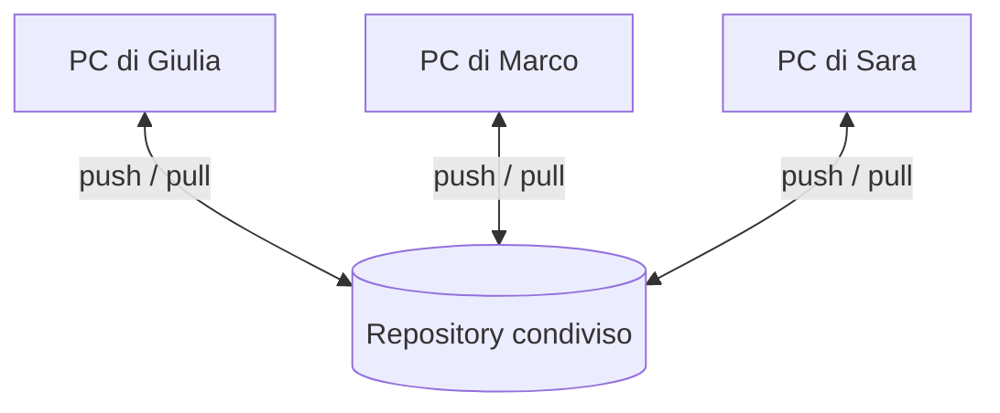

## Lezione 4.3: Repository condiviso e revisione

Modulo 4: Strumenti del team. Informatica per l'Impresa e Soft Skills Digitale

---

## Repository remoto

- Repository bare in una cartella condivisa; protocollo locale, nessun account

---

## I comandi

- `git remote add origin percorso`, `git push -u origin main`
- `git clone`, `git pull`, `git fetch`, `git push`
- Push rifiutato se mancano commit dei compagni: prima `git pull`

---

## Revisione del codice

- Trovare errori, mantenere il codice leggibile, condividere la conoscenza
- Progettazione, funzionalità, complessità, test, nomi, commenti, stile, documentazione
- `git diff main...origin/us03-cancella`
- Riscontri sul codice, motivati, anche su ciò che è fatto bene

---

## Regole di integrazione

1. `main` funziona sempre
2. Un ramo per storia
3. `git pull` prima di iniziare e di inviare
4. Test prima di ogni push
5. Revisione di un compagno prima di `main`

---

## Laboratorio

1. `python crea_repository_condivisi.py ...` (docente); push del Product Owner, clone dei membri
2. Una modifica ciascuno, `python prima_del_push.py`, revisione, integrazione; 13 test
3. Stessa storia su tutti i PC

---

## Aspetti orientativi

- Revisione del codice: pratica standard fin dal primo giorno
- Dare e ricevere riscontri costruttivi
- Più utile ricevere o fare la revisione?
