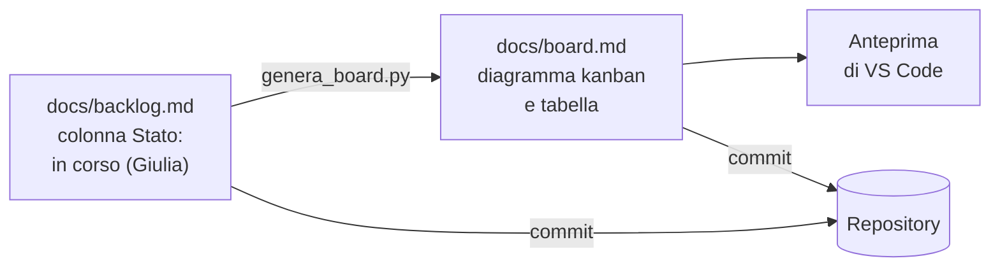
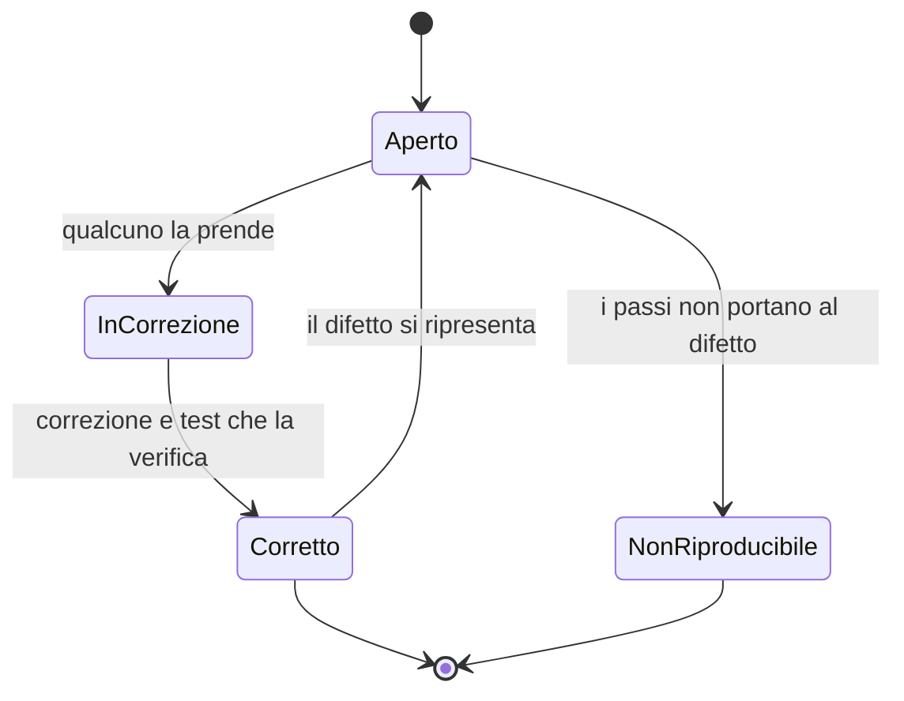

# Lezione 4.4: Documentazione e board

> Contenuto originale. Riferimenti: "Keep a Changelog" 1.1.0, versione italiana, https://keepachangelog.com/it-IT/1.1.0/ ; documentazione di Mermaid, diagrammi Kanban, https://github.com/mermaid-js/mermaid/blob/develop/packages/mermaid/src/docs/syntax/kanban.md . I materiali del laboratorio sono nella cartella `laboratorio`.

Obiettivo: conoscere i documenti di un progetto software e i loro lettori, tenere documentazione, board e diagrammi nel repository insieme al codice, e segnalare i difetti in modo utile.

## 4.4.1 Documentare per chi legge

Ogni documento ha un lettore diverso; scriverlo pensando a chi lo leggerà è la regola principale.

| Documento | Lettore | Contenuto | Nel progetto |
|---|---|---|---|
| **README** | chi arriva nel progetto: sviluppatori, tecnici | che cos'è, requisiti, come si avvia, come si eseguono i test, struttura | `README.md` |
| **Manuale utente** | chi usa il programma | come fare ogni operazione, esempi, messaggi di errore | `docs/manuale_utente.md` |
| **CHANGELOG** | utenti e sviluppatori | che cosa cambia in ogni versione | `CHANGELOG.md` |
| **Documenti di progetto** | team e cliente | requisiti, backlog, decisioni, rischi | `docs/` |
| **Commenti e docstring** | chi modifica il codice | perché il codice è fatto così, che cosa fa una funzione | nei file `.py` |

Conservare la documentazione in Markdown nel repository, invece che in documenti separati, ha vantaggi precisi:

- documento e codice cambiano insieme, nello stesso commit, e la storia mostra chi ha cambiato che cosa
- la documentazione si rivede come il codice
- i diagrammi scritti in Mermaid sono testo: si confrontano con `git diff` e si uniscono con `git merge`, cosa impossibile con un'immagine

### Il CHANGELOG

Il formato "Keep a Changelog" propone:

- le versioni in ordine dalla più recente, con data
- una sezione per le modifiche non ancora rilasciate, in cima
- le modifiche raggruppate per tipo: aggiunte, modificate, deprecate, rimosse, corrette, di sicurezza
- frasi scritte per le persone, non l'elenco dei commit

Il formato originale usa etichette in inglese (Unreleased, Added, Changed, Deprecated, Removed, Fixed, Security); il kit usa le traduzioni italiane (Non rilasciato, Aggiunto, Modificato, Deprecato, Rimosso, Corretto, Sicurezza). Ciò che conta è usarle sempre allo stesso modo.

Esempio dopo una storia completata:

```markdown
## [Non rilasciato]

### Aggiunto

- Elenco delle prenotazioni di un giorno, ordinate per aula e orario (US-02).

### Corretto

- Una prenotazione sovrapposta a un'altra nella stessa aula ora viene rifiutata (US-01, difetto D-01).
```

## 4.4.2 La board nel repository

Nella lezione 3.3 la board è stata scritta a mano. Tenerla allineata al backlog a mano è faticoso e porta a errori: due documenti che dicono cose diverse. La soluzione del corso è una **fonte unica**: lo stato di ogni storia si scrive solo nella colonna Stato del backlog, e la board si genera da lì.

Diagramma: dal backlog alla board.



Stati ammessi nella colonna Stato: `da fare`, `in corso (nome)`, `in revisione (nome)`, `fatto`.

## 4.4.3 Segnalare un difetto

- **Difetto** (bug): comportamento del programma diverso da quello atteso.
- **Segnalazione di difetto**: descrizione che permette a un'altra persona di riprodurre il problema senza chiedere altro.

Una buona segnalazione contiene:

- un titolo che descrive il problema, non la causa supposta
- i **passi per riprodurlo**, con i dati usati
- il **risultato atteso** e il **risultato ottenuto**, con il messaggio di errore copiato esattamente
- la versione (il commit) in cui si è osservato
- la **gravità**: quanto danneggia gli utenti (bloccante, grave, minore, estetica)

Gravità e priorità sono diverse: la gravità misura il danno, la priorità decide quando correggere. Un refuso nella schermata iniziale ha gravità bassa ma può avere priorità alta, se il programma va presentato domani.

Diagramma: il ciclo di vita di una segnalazione.



Ogni difetto corretto dovrebbe portare con sé un **test** che lo riproduce: se il difetto si ripresenta in futuro, il test fallisce.

## 4.4.4 Laboratorio

Tempo indicativo: 45 minuti. Cartella di lavoro `C:\corso-impresa\lab44`, con i file della cartella `laboratorio`, e il repository del team. Le modifiche al repository si fanno con un ramo, una revisione e l'integrazione, come nella lezione 4.3; ogni parte può essere assegnata a un membro diverso.

### Parte 1: board generata dal backlog (15 minuti)

1. Aggiornare la colonna Stato del backlog: le storie restano `da fare`, tranne US-00 (`fatto (kit)`).
2. Generare la board:

```powershell
python C:\corso-impresa\lab44\genera_board.py docs\backlog.md docs\board.md --limite-in-corso 3 --limite-in-revisione 2
```

3. Provare: segnare una storia come `in corso (nome)` e una come `in revisione` senza nome, rigenerare e leggere gli avvisi:

```text
Board scritta in docs\board.md
ATTENZIONE: US-03 è in revisione ma non indica chi ci lavora
```

4. Rimettere le storie `da fare`, rigenerare, registrare backlog e board nello stesso commit.

Come si leggono persona e stato:

```python
persona = re.search(r"\(([^)]*)\)", stato)
stato_base = re.sub(r"\(.*?\)", "", stato).strip().lower()
```

- la prima espressione regolare cerca un testo tra parentesi e lo cattura: è il nome di chi lavora sulla storia
- la seconda toglie la parte tra parentesi e lascia lo stato, portato in minuscolo
- le storie Won't non compaiono nella board; le priorità Must, Should e Could diventano le priorità del diagramma (bordo colorato della scheda)
- dal testo delle schede si tolgono le parentesi quadre e graffe, che interromperebbero la sintassi di Mermaid

Test: `python test_genera_board.py` (17 test).

### Parte 2: la prima segnalazione di difetto (10 minuti)

Il file `esempio_segnalazione_difetto.md` descrive il difetto delle prenotazioni sovrapposte (D-01). Riprodurlo seguendo i passi, poi scrivere con `modello_segnalazione_difetto.md` la segnalazione di un altro comportamento del kit che il team considera sbagliato o poco chiaro (per esempio un messaggio in inglese, un orario come `9:5` accettato o rifiutato...). Salvare le segnalazioni in `docs/difetti/`.

### Parte 3: manuale e CHANGELOG (15 minuti)

1. Copiare `modello_manuale_utente.md` in `docs/manuale_utente.md` e scrivere le sezioni per le due funzioni del kit (elenco aule e prenotazione), con esempi reali e la tabella dei messaggi di errore.
2. Aggiungere al CHANGELOG, nella sezione "Non rilasciato", una riga per il manuale.

### Parte 4: controllo finale (5 minuti)

Dopo le integrazioni: `git pull`, `python -m unittest`, `git log --oneline --graph` e `controlla_repository.py` della lezione 4.1. Il repository è pronto per lo sprint 1.

## 4.4.5 Aspetti orientativi (discussione)

- Il **technical writer** scrive manuali, guide e documentazione tecnica: una professione che unisce competenze informatiche e di scrittura.
- I **tester** passano gran parte del tempo a riprodurre, descrivere e verificare difetti: una buona segnalazione fa risparmiare ore di lavoro agli sviluppatori.
- Domanda: nel manuale scritto dal team, che cosa ha capito subito un compagno di un altro team, e che cosa no?
