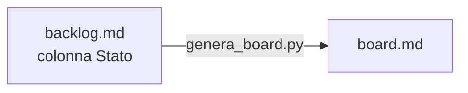

## Lezione 4.4: Documentazione e board

Modulo 4: Strumenti del team. Informatica per l'Impresa e Soft Skills Digitale

---

## Documentare per chi legge

- README: chi arriva nel progetto
- Manuale utente: chi usa il programma
- CHANGELOG: che cosa cambia in ogni versione
- Documenti di progetto, commenti e docstring
- Tutto in Markdown nel repository, con il codice

---

## Il CHANGELOG

- Versioni dalla più recente; sezione "Non rilasciato"
- Aggiunto, Modificato, Deprecato, Rimosso, Corretto, Sicurezza
- Frasi per le persone, non l'elenco dei commit

---

## Una fonte unica

- Stati: da fare, in corso (nome), in revisione (nome), fatto

---

## Segnalare un difetto

- Titolo, passi per riprodurre, atteso, ottenuto, versione, gravità
- Gravità: danno; priorità: quando correggere
- Ogni correzione con un test che riproduce il difetto

---

## Laboratorio

1. `python genera_board.py docs\backlog.md docs\board.md`; 17 test
2. Segnalazione di un difetto in `docs/difetti/`
3. Manuale utente e CHANGELOG
4. Controllo finale del repository

---

## Aspetti orientativi

- Technical writer: informatica e scrittura
- Tester: riprodurre e descrivere i difetti
- Che cosa ha capito del manuale un altro team?
