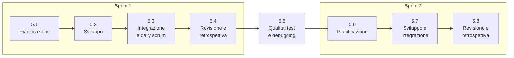

# Lezione 5.1: Pianificazione dello sprint 1

> Contenuto originale. Riferimenti: Ken Schwaber e Jeff Sutherland, "La Guida a Scrum" (2020), licenza CC BY-SA 4.0, https://scrumguides.org/scrum-guide.html (Sprint Planning, Sprint Backlog, Definition of Done; sintesi nella lezione 3.2). I materiali del laboratorio sono nella cartella `laboratorio`.

Obiettivo: pianificare il primo sprint del progetto: obiettivo dello sprint, storie scelte in base a priorità e capacità, scomposizione in compiti, definizione di "fatto" del team.

## 5.1.1 Lo sprint del corso

Da questa lezione il team lavora come uno Scrum Team (lezione 3.2). Ogni sprint dura quattro lezioni:



Il tempo di sviluppo in classe è poco: circa due ore per sprint. Il lavoro a casa è facoltativo e va concordato nel team; la pianificazione deve essere realistica per il tempo in classe.

## 5.1.2 Le tre domande della pianificazione

La pianificazione risponde a tre domande:

1. **Perché** questo sprint ha valore? Si formula l'**obiettivo dello sprint** (Sprint Goal): una frase che dice che cosa cambierà per il cliente, per esempio "i docenti non trovano più laboratori occupati e i tecnici sanno ogni mattina che cosa preparare".
2. **Che cosa** si può completare? Il team sceglie dal backlog, partendo dalla cima, le storie che servono all'obiettivo, finché la somma delle stime non raggiunge la **capacità**.
3. **Come** si farà il lavoro? Ogni storia si scompone in **compiti** di poche ore, che i membri del team scelgono.

L'obiettivo, le storie scelte e i compiti formano lo **Sprint Backlog**, che appartiene agli sviluppatori: il Product Owner propone e chiarisce, ma sono gli sviluppatori a decidere quanto lavoro prendere.

### La capacità del primo sprint

Per il primo sprint la velocità non è ancora nota. Una stima prudente: contare le ore di sviluppo in classe (circa 2 ore per 4-5 persone), considerare che una parte del tempo va in riunioni, revisioni e imprevisti, e scegliere poche storie piccole. Meglio finire tutto e aggiungere una storia che lasciarne metà a metà: una storia non finita vale zero punti.

## 5.1.3 Scomporre una storia in compiti

Esempio: US-01, "nessuna prenotazione sovrapposta" (5 punti).

| Compito | Chi | Fatto |
|---|---|---|
| Scrivere i test dai tre criteri di accettazione | ... | [ ] |
| Scrivere in `logica.py` la funzione che controlla se due orari si sovrappongono | ... | [ ] |
| Usarla in `nuova_prenotazione` per rifiutare la prenotazione, con un messaggio che indica quella esistente | ... | [ ] |
| Correggere i dati di esempio (prenotazioni 3 e 4 sovrapposte) | ... | [ ] |
| Aggiornare manuale e CHANGELOG | ... | [ ] |
| Revisione e integrazione | ... | [ ] |

Un buon compito:

- è abbastanza piccolo da finire in una lezione
- ha un risultato verificabile
- lo prende una persona, che ne diventa responsabile, anche se può chiedere aiuto

Due orari si sovrappongono quando uno inizia prima che l'altro finisca e finisce dopo che l'altro è iniziato: `inizio1 < fine2 and inizio2 < fine1`. Una prenotazione che finisce alle 11:00 e una che inizia alle 11:00 non si sovrappongono, come richiede il secondo criterio di US-01.

## 5.1.4 La definizione di "fatto"

- **Definizione di "fatto"** (Definition of Done)
  elenco delle condizioni che ogni storia deve soddisfare per essere considerata completa. È la stessa per tutte le storie ed è l'impegno legato all'incremento (lezione 3.2).

I criteri di accettazione sono diversi per ogni storia (che cosa deve fare); la definizione di "fatto" vale per tutte (con quale qualità): test, revisione, documentazione, integrazione. Senza una definizione condivisa, "fatto" significa cose diverse per persone diverse: per uno "il codice c'è", per un altro "è provato, rivisto e documentato".

## 5.1.5 Laboratorio

Tempo indicativo: 45 minuti. Cartella di lavoro: il repository del team, con i file della cartella `laboratorio` in `C:\corso-impresa\lab51`. Il file `backlog_esempio.md` è il backlog di un team di fantasia alla fine del modulo 3, utile per provare lo script.

### Parte 1: definizione di "fatto" (10 minuti)

Il team discute `definizione_di_fatto.md`, lo adatta e lo salva in `docs/` nel repository.

### Parte 2: obiettivo e storie (20 minuti)

1. Il Product Owner presenta le storie in cima al backlog e propone un obiettivo.
2. Gli sviluppatori stimano la capacità e scelgono le storie.
3. Controllo e creazione dello Sprint Backlog:

```powershell
python C:\corso-impresa\lab51\pianifica_sprint.py docs\backlog.md --numero 1 --capacita 10 --storie US-01 US-02 US-04 --obiettivo "Niente sovrapposizioni e tecnici informati"
```

```text
ATTENZIONE: storie Must lasciate fuori mentre se ne scelgono di priorità minore: US-03
Storie scelte: 3; punti: 9 su una capacità di 10
Sprint Backlog scritto in docs\sprint1.md
```

- lo script controlla che ogni storia esista, non sia già fatta, abbia stima e criteri di accettazione; somma le stime e le confronta con la capacità; avvisa se si lascia fuori una storia Must scegliendone una di priorità minore
- un avviso ATTENZIONE non blocca: il team può avere un motivo (per esempio US-03 dipende da una decisione del cliente), ma deve saperlo spiegare
- se ci sono problemi DA SISTEMARE il file dello sprint non viene scritto

Come si contano i criteri di accettazione di ogni storia:

```python
titolo = TITOLO.match(riga)
if titolo:
    corrente = titolo.group(1)
elif riga.startswith("#"):
    corrente = None
elif corrente in storie and CRITERIO.match(riga.strip()):
    storie[corrente]["criteri"] += 1
```

- `corrente` ricorda in quale sezione di storia ci si trova; un altro titolo la chiude
- `CRITERIO` riconosce le righe `- Dato ..., quando ..., allora ...`

Test: `python test_pianifica_sprint.py` (10 test).

### Parte 3: compiti (15 minuti)

Nel file `docs/sprint1.md` il team scompone ogni storia in compiti e ciascuno sceglie il primo. Il Product Owner aggiorna nel backlog lo stato delle storie scelte, la board si rigenera (`genera_board.py`, lezione 4.4) e si registra tutto con un commit su `main` (lo Sprint Backlog è un documento di tutto il team). Infine si registra il punto di partenza del grafico burndown (lezione 5.3):

```powershell
python C:\corso-impresa\lab53\burndown.py docs\burndown.csv --backlog docs\backlog.md --sprint docs\sprint1.md --registra 5.1
```

## 5.1.6 Aspetti orientativi (discussione)

- Stimare la propria capacità in modo onesto, né troppo ottimista né troppo prudente, è una competenza richiesta in ogni lavoro organizzato per obiettivi.
- Nelle aziende la pianificazione dello sprint coinvolge spesso anche tester, designer e, a volte, il cliente: tutti portano informazioni diverse.
- Domanda: la capacità scelta dal team è stata ottimista o prudente? Si verificherà nella lezione 5.4.
