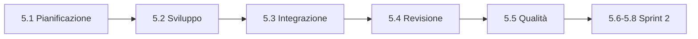

## Lezione 5.1: Pianificazione dello sprint 1

Modulo 5: Due sprint di sviluppo. Informatica per l'Impresa e Soft Skills Digitale

---

## Due sprint

- Circa due ore di sviluppo in classe per sprint

---

## Perché, che cosa, come

- Obiettivo dello sprint: che cosa cambia per il cliente
- Storie dalla cima del backlog fino alla capacità
- Compiti di poche ore, ciascuno con un responsabile
- Una storia non finita vale zero punti

---

## Scomporre US-01

- Test dai tre criteri
- Funzione `si_sovrappongono`: `inizio1 < fine2 and inizio2 < fine1`
- Controllo in `nuova_prenotazione`, dati di esempio, manuale, revisione

---

## Definizione di "fatto"

- Uguale per tutte le storie: test, revisione, integrazione, documentazione
- I criteri di accettazione dicono che cosa, la definizione di "fatto" con quale qualità

---

## Laboratorio

1. Definizione di "fatto" del team
2. `python pianifica_sprint.py docs\backlog.md --numero 1 --capacita 10 --storie ...`; 10 test
3. Compiti, backlog, board, primo punto del burndown

---

## Aspetti orientativi

- Stimare la propria capacità in modo onesto
- Capacità ottimista o prudente? Lo dirà la lezione 5.4
