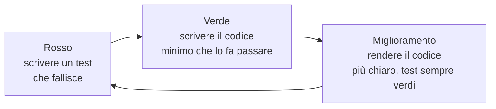

# Lezione 5.2: Sviluppo con branch e test

> Contenuto originale. Riferimenti: documentazione di Python, modulo unittest, https://docs.python.org/3/library/unittest.html ; Wikipedia, "Test-driven development", https://en.wikipedia.org/wiki/Test-driven_development . I materiali del laboratorio sono nella cartella `laboratorio`.

Obiettivo: sviluppare le storie dello sprint partendo dai criteri di accettazione trasformati in test, con un ramo per storia e piccoli commit.

## 5.2.1 Prima i test

Nello **sviluppo guidato dai test** (test-driven development, TDD) si scrive prima un test che descrive il comportamento atteso, lo si vede fallire, poi si scrive il codice minimo per farlo passare, e infine si migliora il codice mantenendo i test verdi.

Diagramma: il ciclo rosso, verde, miglioramento.



Perché partire dai test:

- il test traduce il criterio di accettazione in qualcosa che il computer verifica: non ci sono dubbi su quando la storia è fatta
- vederlo fallire prima garantisce che il test controlli davvero qualcosa
- i test restano nel progetto e proteggono il lavoro fatto: se una modifica futura rompe una storia, un test lo segnala

## 5.2.2 Dal criterio al test

Ogni criterio Dato, Quando, Allora (lezione 2.2) diventa un metodo di test:

| Parte del criterio | Nel test |
|---|---|
| **Dato** che LAB-INF1 è prenotato il 12/10 dalle 9:00 alle 11:00 | si preparano i dati: un elenco con quella prenotazione |
| **Quando** prenoto LAB-INF1 il 12/10 dalle 10:00 alle 12:00 | si chiama la funzione da provare |
| **Allora** la prenotazione è rifiutata con un messaggio... | si controlla il risultato con `self.assert...` |

```python
class TestUS01(unittest.TestCase):

    def setUp(self):
        # Dato che LAB-INF1 è prenotato il 12/10 dalle 9:00 alle 11:00
        self.prenotazioni = []
        logica.nuova_prenotazione(self.prenotazioni, AULE, "LAB-INF1", "2026-10-12",
                                  "9:00", "11:00", "M. Bianchi")

    def test_criterio_1_sovrapposizione_rifiutata(self):
        # quando prenoto LAB-INF1 il 12/10 dalle 10:00 alle 12:00
        with self.assertRaises(logica.ErrorePrenotazione) as errore:
            logica.nuova_prenotazione(self.prenotazioni, AULE, "LAB-INF1", "2026-10-12",
                                      "10:00", "12:00", "L. Verdi")
        # allora la prenotazione è rifiutata con un messaggio che indica quella già presente
        self.assertIn("prenotazione 1, M. Bianchi", str(errore.exception))
```

- `setUp` viene eseguito prima di ogni test: è il posto per il "Dato" comune a più criteri
- `assertRaises` usato con `with` verifica che il codice sollevi l'errore; `as errore` permette poi di controllarne il messaggio
- `assertIn` verifica che un testo ne contenga un altro: il test non dipende dalla frase esatta, ma dalle informazioni importanti
- il test chiama `logica.nuova_prenotazione` direttamente: le regole si provano senza file e senza terminale, grazie alla separazione dei moduli del kit (lezione 1.3)

Metodi di controllo più usati:

| Metodo | Verifica che |
|---|---|
| `assertEqual(a, b)` | a sia uguale a b |
| `assertTrue(x)`, `assertFalse(x)` | x sia vero, falso |
| `assertIn(a, b)` | a sia contenuto in b |
| `assertIsNone(x)` | x sia None |
| `assertRaises(Errore)` | il blocco sollevi l'errore indicato |

Casi da provare oltre ai criteri: i **casi limite** (un orario che finisce quando l'altro inizia, un elenco vuoto, il primo e l'ultimo elemento) e i **casi di errore** (dati non validi, elementi inesistenti).

## 5.2.3 Piccoli commit su un ramo

Il flusso della lezione 4.2, applicato allo sviluppo:

1. `git switch main` e `git pull`;
2. `git switch -c us01-sovrapposizioni`;
3. scheletro dei test dai criteri, commit ("Aggiungi i test di US-01");
4. per ogni test: codice, test verdi, commit;
5. manuale e CHANGELOG, commit;
6. `prima_del_push.py`, `git push -u origin us01-sovrapposizioni`, richiesta di revisione (lezione 5.3).

Un commit piccolo con test verdi è un punto sicuro a cui tornare. Se si lavora in coppia sulla stessa storia, conviene che una persona scriva e l'altra osservi e suggerisca, scambiandosi il ruolo ogni 15-20 minuti (programmazione in coppia).

## 5.2.4 Laboratorio

Tempo indicativo: 50 minuti. Cartella di lavoro: il repository del team; gli script sono in `C:\corso-impresa\lab52`.

### Parte 1: lo scheletro dei test (10 minuti)

All'inizio della lezione lo Scrum Master registra il punto del grafico burndown: `python C:\corso-impresa\lab53\burndown.py docs\burndown.csv --backlog docs\backlog.md --sprint docs\sprint1.md --registra 5.2` (spiegazione nella lezione 5.3).

Per ogni storia presa in carico, nel repository del team:

```powershell
git switch -c us01-sovrapposizioni
python C:\corso-impresa\lab52\criteri_in_test.py docs\backlog.md US-01
python -m unittest
```

```text
Scritti 3 test da completare in tests\test_us01.py
...
FAILED (failures=3)
```

Il file generato ha un test per criterio, con il criterio come docstring e tre commenti da trasformare in codice:

```python
    def test_criterio_1(self):
        """Dato che LAB-INF1 è prenotato il 12/10 dalle 9:00 alle 11:00, quando prenoto ..., allora ..."""
        # Dato che LAB-INF1 è prenotato il 12/10 dalle 9:00 alle 11:00
        # quando prenoto LAB-INF1 il 12/10 dalle 10:00 alle 12:00
        # allora la prenotazione è rifiutata con un messaggio che indica la prenotazione già presente.
        self.fail("test da scrivere")
```

Come il programma divide il criterio:

```python
CRITERIO = re.compile(r"^-\s*((?:dato|data|dati|date)\b.*?),\s*(quando\b.*?),\s*(allora\b.*)$", re.IGNORECASE)
```

- tre gruppi tra parentesi catturano le tre parti; `.*?` prende il testo più breve possibile fino alla virgola che precede "quando" e "allora"
- `(?:dato|data|dati|date)` accetta le quattro forme; `(?:...)` raggruppa senza catturare
- le virgolette presenti nel criterio vengono sostituite con apici nella docstring, perché la chiuderebbero

Il programma non sovrascrive un file di test esistente. Test: `python test_criteri_in_test.py` (11 test).

Registrare lo scheletro con un commit.

### Parte 2: sviluppo (40 minuti)

Ciclo rosso, verde, miglioramento per ogni test, con un commit ogni volta che i test tornano verdi. Suggerimenti:

- US-01: scrivere prima una funzione `si_sovrappongono(inizio1, fine1, inizio2, fine2)` con i suoi test, poi usarla in `nuova_prenotazione`; ricordarsi dei dati di esempio (prenotazioni 3 e 4)
- US-02 e US-03: prima la funzione in `logica.py` con i test, poi il comando in `prenotazioni.py`, sul modello dei comandi esistenti
- se un test del kit smette di passare dopo una modifica, capire perché prima di cambiarlo: ha sbagliato il codice nuovo o il test si basava su un'ipotesi che non vale più?

A fine lezione: nel backlog, stato `in corso (nome)` o `in revisione (nome)` per le storie avviate, board rigenerata.

## 5.2.5 Aspetti orientativi (discussione)

- Scrivere test automatici è parte del lavoro quotidiano degli sviluppatori; esistono anche figure specializzate nell'automazione dei test (test automation engineer).
- Molte aziende chiedono nei colloqui tecnici di scrivere una piccola funzione con i suoi test: saper partire dai casi da verificare è un vantaggio.
- Domanda: scrivere prima il test ha cambiato il modo di pensare la funzione?
