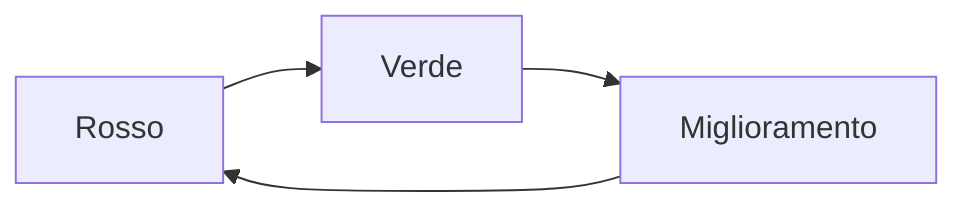

## Lezione 5.2: Sviluppo con branch e test

Modulo 5: Due sprint di sviluppo. Informatica per l'Impresa e Soft Skills Digitale

---

## Prima i test

- Il test traduce il criterio; vederlo fallire prova che controlla qualcosa

---

## Dal criterio al test

- Dato: preparare i dati (anche in `setUp`)
- Quando: chiamare la funzione
- Allora: `assertEqual`, `assertIn`, `assertRaises`
- Casi limite e casi di errore

---

## Piccoli commit su un ramo

- `git switch -c us01-sovrapposizioni`
- Scheletro dei test, poi codice, commit a test verdi
- Programmazione in coppia: chi scrive e chi osserva, a turno

---

## Laboratorio

1. `python criteri_in_test.py docs\backlog.md US-01`: un test per criterio; 11 test
2. Ciclo rosso, verde, miglioramento per ogni storia
3. Se un test del kit si rompe: sbaglia il codice o il test?

---

## Aspetti orientativi

- Test automation engineer
- Colloqui tecnici: una funzione con i suoi test
