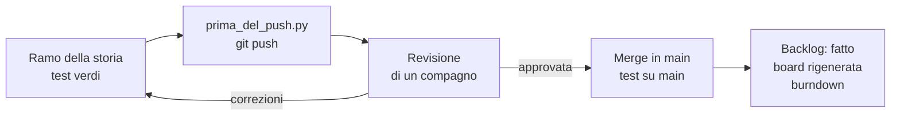

# Lezione 5.3: Integrazione e daily scrum

> Contenuto originale. Riferimenti: Ken Schwaber e Jeff Sutherland, "La Guida a Scrum" (2020), licenza CC BY-SA 4.0, https://scrumguides.org/scrum-guide.html (Daily Scrum); Wikipedia, "Burn down chart", https://en.wikipedia.org/wiki/Burn_down_chart . I materiali del laboratorio sono nella cartella `laboratorio`.

Obiettivo: condurre un daily scrum breve ed efficace, far emergere e gestire gli ostacoli, misurare l'avanzamento con il grafico burndown e integrare spesso il lavoro completato.

## 5.3.1 Il daily scrum

Il **daily scrum** è una riunione di 15 minuti al massimo, ogni giorno di lavoro dello sprint (nel corso: all'inizio di ogni lezione di sviluppo, in 10 minuti). Serve agli sviluppatori per controllare l'avanzamento verso l'obiettivo dello sprint e adattare il piano della giornata.

Una traccia molto diffusa, non obbligatoria nella Guida a Scrum del 2020, sono tre domande per ciascuno:

1. che cosa ho fatto dall'ultima volta per l'obiettivo dello sprint?
2. che cosa farò oggi?
3. c'è qualcosa che mi blocca?

Regole pratiche:

- in piedi, davanti alla board: si parla del lavoro, non si risolvono i problemi
- se un argomento richiede discussione, lo si rimanda a dopo, solo con chi è coinvolto
- si guarda l'obiettivo dello sprint, non solo il proprio compito: "siamo in linea?"
- lo Scrum Master tiene il tempo e annota gli ostacoli

## 5.3.2 Ostacoli

- **Ostacolo** (impediment): qualunque cosa impedisca a una persona o al team di procedere: un dubbio sui requisiti, un errore che non si riesce a capire, un conflitto nel repository, un compagno assente, un PC che non funziona.

Un ostacolo va segnalato presto: dopo 15 minuti bloccati si chiede aiuto (accordo di team, lezione 1.2). Lo Scrum Master aiuta a rimuoverlo o a trovare chi può farlo: un compagno, il Product Owner per i dubbi sui requisiti, il docente per i problemi tecnici o organizzativi.

| Ostacolo | Chi può aiutare |
|---|---|
| Criterio di accettazione ambiguo | Product Owner, che chiede al cliente |
| Test che fallisce senza motivo evidente | un compagno (revisione in coppia), debugging (lezione 5.5) |
| Conflitto nel merge | chi ha scritto l'altra versione |
| Storia più grande del previsto | tutto il team: dividerla o ridurla, con il Product Owner |

## 5.3.3 Il grafico burndown

Il **burndown** mostra, lezione dopo lezione, quanti punti mancano per completare le storie dello sprint, confrontati con una linea ideale che scende in modo regolare fino a zero.

- punti rimanenti sopra la linea ideale: il team è in ritardo; conviene capire perché e decidere se ridurre il lavoro con il Product Owner
- una linea piatta per più lezioni: storie iniziate ma non finite; meglio finirne una prima di iniziarne un'altra
- conta solo il lavoro **fatto** secondo la definizione di "fatto": una storia al 90% vale zero punti

## 5.3.4 Integrare spesso

Più a lungo un ramo resta separato da `main`, più cresce il rischio di conflitti difficili. Pratiche per integrare spesso:

- storie piccole, un ramo per storia, integrato appena la storia è fatta
- `git pull` su `main` e aggiornamento del proprio ramo (`git merge main` nel ramo) almeno a ogni lezione
- revisione rapida: chi riceve una richiesta di revisione la fa entro la lezione
- dopo ogni integrazione: test su `main`, backlog e board aggiornati

Diagramma: il percorso di una storia verso `main`.



## 5.3.5 Laboratorio

Tempo indicativo: 55 minuti. Cartella di lavoro: il repository del team; gli script sono in `C:\corso-impresa\lab53`.

### Parte 1: burndown (5 minuti)

Il punto di partenza si registra alla fine della pianificazione (lezione 5.1, con `--registra 5.1`), poi un punto all'inizio di ogni lezione dello sprint. Se i punti delle lezioni precedenti mancano, si registrano ora con i valori ricostruiti dalla storia del backlog (`git log docs/backlog.md`).

```powershell
python C:\corso-impresa\lab53\burndown.py docs\burndown.csv --backlog docs\backlog.md --sprint docs\sprint1.md --registra 5.3
```

```text
Registrati 8 punti rimanenti per la lezione 5.3
Lezione    Rimanenti  Ideale
5.1               10      10
5.2               10     6.7
5.3                8     3.3

In ritardo di 4.7 punti rispetto alla linea ideale: parlarne nel daily scrum.
Grafico scritto in docs\burndown.grafico.md
```

- i punti rimanenti sono la somma delle stime delle storie dello sprint (sezione "## Storie" di `sprint1.md`) che nel backlog non sono ancora `fatto`
- la linea ideale divide i punti iniziali in parti uguali sulle lezioni dello sprint (3 nello sprint 1, opzione `--lezioni`); ogni riga del file corrisponde a un punto della linea, quindi va registrata una riga per lezione
- nell'esempio la linea è rimasta piatta nella lezione 5.2: nessuna storia era ancora fatta, anche se tutte erano iniziate
- il grafico Mermaid mostra le due linee; si apre con l'anteprima di VS Code

Come si calcolano i punti rimanenti:

```python
return sum(stima for c in sprint for stima, stato in [backlog[c]] if not stato.startswith("fatto"))
```

- `sprint` è l'elenco dei codici delle storie dello sprint, `backlog[c]` la coppia (stima, stato) letta dal backlog
- `for stima, stato in [backlog[c]]` è un modo compatto per dare un nome ai due valori della coppia dentro l'espressione
- la fonte dello stato è sempre il backlog: il file dello sprint dice solo quali storie contare

Test: `python test_burndown.py` (11 test).

### Parte 2: daily scrum (10 minuti)

Davanti alla board (anteprima di `docs/board.md` proiettata o su un PC), con il grafico burndown. Lo Scrum Master tiene il tempo e compila `registro_daily_scrum.md` (da copiare in `docs/daily_scrum.md`).

### Parte 3: sviluppo e integrazione (35 minuti)

- completare le storie in corso; per ogni storia finita: `prima_del_push.py`, push del ramo, revisione con la lista di controllo della lezione 4.3, merge in `main`, test, backlog e board aggiornati
- chi è bloccato lo dice subito; lo Scrum Master controlla gli ostacoli annotati
- il docente, come cliente, è disponibile per chiarire i criteri di accettazione

### Parte 4: chiusura (5 minuti)

`git pull` su `main` su tutti i PC; test; burndown aggiornato; commit dei documenti dello sprint.

## 5.3.6 Aspetti orientativi (discussione)

- Nei team distribuiti il daily scrum si fa in videochiamata, spesso con persone in paesi diversi: la puntualità e la brevità diventano ancora più importanti.
- Segnalare un problema presto, senza aspettare che diventi grave, è una qualità molto apprezzata in qualunque ambiente di lavoro.
- Domanda: il daily scrum ha fatto emergere un ostacolo che altrimenti sarebbe rimasto nascosto?
