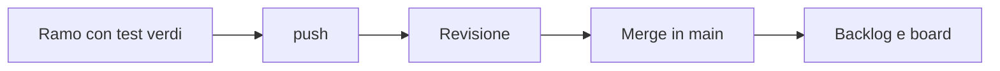

## Lezione 5.3: Integrazione e daily scrum

Modulo 5: Due sprint di sviluppo. Informatica per l'Impresa e Soft Skills Digitale

---

## Il daily scrum

- 15 minuti al massimo (nel corso 10), in piedi davanti alla board
- Fatto, farò, ostacoli: traccia diffusa, non obbligatoria
- Siamo in linea con l'obiettivo dello sprint?

---

## Ostacoli

- Segnalarli presto: dopo 15 minuti bloccati si chiede aiuto
- Criteri ambigui: Product Owner; test misteriosi: un compagno; conflitti: chi ha scritto l'altra versione

---

## Il burndown

- Punti rimanenti lezione per lezione, contro la linea ideale
- Sopra la linea: ritardo; linea piatta: storie iniziate e non finite
- Conta solo il lavoro fatto

---

## Integrare spesso

---

## Laboratorio

1. `python burndown.py docs\burndown.csv --backlog ... --sprint ... --registra 5.3`; 11 test
2. Daily scrum con il registro
3. Sviluppo, revisione, integrazione

---

## Aspetti orientativi

- Daily scrum in videochiamata nei team distribuiti
- Segnalare presto un problema: qualità apprezzata ovunque
