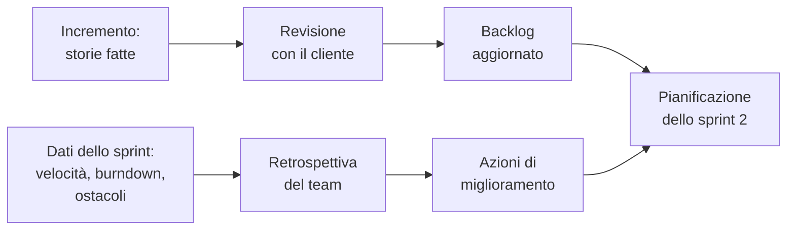

# Lezione 5.4: Revisione e retrospettiva dello sprint 1

> Contenuto originale. Riferimenti: Ken Schwaber e Jeff Sutherland, "La Guida a Scrum" (2020), licenza CC BY-SA 4.0, https://scrumguides.org/scrum-guide.html (Sprint Review, Sprint Retrospective). I materiali del laboratorio sono nella cartella `laboratorio`.

Obiettivo: chiudere il primo sprint: mostrare al cliente le storie completate e raccogliere i riscontri, misurare la velocità, e migliorare il modo di lavorare con la retrospettiva.

## 5.4.1 Due eventi diversi

| | Revisione (Sprint Review) | Retrospettiva (Sprint Retrospective) |
|---|---|---|
| Oggetto | il **prodotto**: che cosa è stato fatto | il **processo**: come si è lavorato |
| Partecipanti | team, cliente e altri portatori di interesse | solo lo Scrum Team |
| Risultato | backlog aggiornato: nuove storie, modifiche, priorità | poche azioni di miglioramento per lo sprint successivo |

Diagramma: da che cosa si parte e che cosa si ottiene.



## 5.4.2 La revisione

La revisione non è una presentazione formale: è un incontro di lavoro in cui il cliente vede il prodotto funzionare e dice che cosa ne pensa. Regole:

- si mostrano solo le storie **fatte** secondo la definizione di "fatto"; le storie non completate si dichiarano, non si mostrano come se fossero finite
- si mostra il programma che funziona, con dati realistici, non le slide o il codice
- ogni dimostrazione fa riferimento ai criteri di accettazione della storia
- il cliente può chiedere modifiche: diventano nuove storie o cambiano storie esistenti nel backlog, non si realizzano "al volo"

### Dare e ricevere riscontri

Per chi dà il riscontro (cliente, altri team): la forma fatto, effetto, proposta (lezione 1.2), su un aspetto concreto.

Per chi lo riceve:

- ascoltare fino in fondo, senza difendersi subito
- chiedere esempi se il riscontro è vago ("che cosa intende per poco chiaro?")
- ringraziare e annotare; la decisione su che cosa fare si prende dopo, con il Product Owner

## 5.4.3 Velocità

- **Velocità**: punti delle storie completate nello sprint. Solo le storie fatte contano; una storia al 90% vale zero e torna nel backlog con la sua stima (eventualmente rivista).
- Il rapporto tra punti completati e pianificati dice quanto era realistica la pianificazione. Un valore basso nel primo sprint è normale: il team non conosceva ancora la propria velocità.
- La velocità si usa per pianificare lo sprint successivo (lezione 5.6), non per giudicare il team né per confrontarlo con altri team: le scale dei punti sono diverse.

## 5.4.4 La retrospettiva

La retrospettiva serve a migliorare il modo di lavorare. Una struttura semplice:

1. **dati**: che cosa è successo (velocità, burndown, ostacoli annotati nei daily scrum);
2. **che cosa ha funzionato** e **che cosa non ha funzionato**, scritti prima individualmente su foglietti, poi raggruppati;
3. **perché**: per il problema più importante si cerca la causa (5 perché, lezione 2.4);
4. **azioni**: al massimo tre, concrete, con un responsabile, verificabili alla retrospettiva successiva.

Un'azione utile è concreta: "chi riceve una richiesta di revisione la fa entro la lezione", non "comunicare meglio". Nella retrospettiva conta la sicurezza psicologica (lezione 1.2): si parla dei problemi del lavoro, non delle colpe delle persone.

## 5.4.5 Laboratorio

Tempo indicativo: 60 minuti. Cartella di lavoro: il repository del team; gli script sono in `C:\corso-impresa\lab54`.

### Parte 1: preparazione (10 minuti)

1. Ultimo punto del burndown (`--registra 5.4`) e integrazione delle storie fatte in `main`.
2. Chiusura dello sprint:

```powershell
python C:\corso-impresa\lab54\metriche_sprint.py chiudi docs\backlog.md docs\sprint1.md
```

```text
Punti pianificati: 10; completati: 7 (70%)
Velocità dello sprint: 7 punti
Storie non completate, da riportare nel backlog: US-03
Risultato aggiunto a docs\sprint1.md
```

- il programma legge le storie della sezione "## Storie" dello sprint e il loro stato nel backlog, e scrive nel file dello sprint una sezione "## Risultato"
- il risultato resta registrato: nella lezione 5.8 si confrontano i due sprint anche se nel frattempo le storie non completate sono state finite
- lo sprint non si può chiudere due volte

Come si ottiene il risultato:

```python
fatte = [c for c, _ in storie if stati[c].startswith("fatto")]
non_fatte = [c for c, _ in storie if c not in fatte]
pianificati = sum(s for _, s in storie)
completati = sum(s for c, s in storie if c in fatte)
```

- `storie` contiene le coppie (codice, stima) scritte nel file dello sprint al momento della pianificazione; `stati` gli stati attuali letti dal backlog
- le stime usate sono quelle della pianificazione: se il team ha cambiato una stima durante lo sprint, la velocità non ne è falsata

Test: `python test_metriche_sprint.py` (12 test).

3. Preparare la dimostrazione con `scaletta_revisione.md`.

### Parte 2: revisione (25 minuti)

Ogni team presenta in 4 minuti, più 1 minuto di domande. Il docente partecipa come cliente; gli altri team annotano un riscontro per il team che presenta. Il Product Owner raccoglie i riscontri nella tabella della scaletta.

### Parte 3: retrospettiva (25 minuti)

Con `retrospettiva.md`, da salvare in `docs/retrospettiva_sprint1.md`. Alla fine: backlog aggiornato con i riscontri della revisione, accordo di team aggiornato se serve, commit su `main`.

## 5.4.6 Aspetti orientativi (discussione)

- Presentare il proprio lavoro a un cliente, e ascoltarne le critiche senza prenderle come un attacco personale, è una competenza richiesta in tutte le professioni a contatto con clienti.
- La retrospettiva è una pratica di miglioramento continuo che si ritrova, con nomi diversi, nella gestione della qualità di molti settori.
- Domanda: quale riscontro del cliente ha sorpreso di più il team? Quale azione della retrospettiva sembra più utile?
