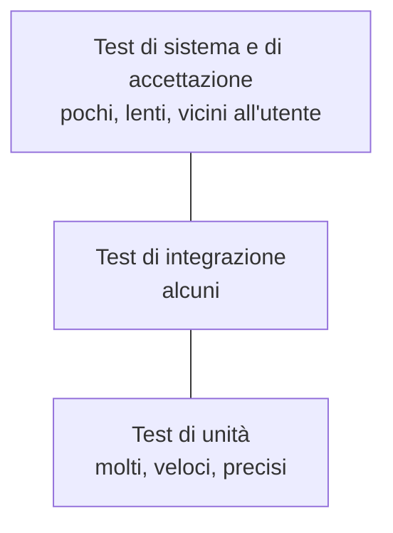
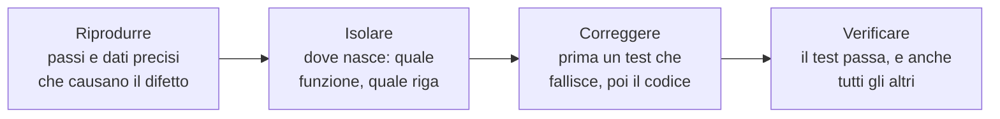

# Lezione 5.5: Qualità: test e debugging

> Contenuto originale. Riferimenti: Visual Studio Code, "Debug code with Visual Studio Code", https://code.visualstudio.com/docs/debugtest/debugging , e "Python debugging in VS Code", https://code.visualstudio.com/docs/python/debugging ; documentazione di Python, modulo trace, https://docs.python.org/3/library/trace.html . I materiali del laboratorio sono nella cartella `laboratorio`.

Obiettivo: conoscere i tipi di test e il significato della copertura, trovare e correggere difetti con un metodo e con il debugger di VS Code, e capire perché test verdi non garantiscono l'assenza di difetti.

## 5.5.1 Tipi di test

| Tipo | Che cosa verifica | Nel progetto |
|---|---|---|
| **Test di unità** | una singola funzione o parte, isolata | i test di `logica.py` e `archivio.py` |
| **Test di integrazione** | più parti che lavorano insieme | i test di `prenotazioni.py`, che usano logica e archivio con file veri in una cartella temporanea |
| **Test di sistema** | il programma completo, come lo usa l'utente | le prove dei comandi nel terminale |
| **Test di accettazione** | che una storia soddisfi i criteri del cliente | i test scritti dai criteri; la dimostrazione nella revisione |
| **Test di regressione** | che una modifica non rompa ciò che funzionava | l'intera suite eseguita dopo ogni modifica |
| **Test esplorativo** | una persona prova il programma cercando comportamenti strani | le prove a mano, non scritte in anticipo |

Diagramma: la "piramide dei test", una regola pratica diffusa: molti test di unità, veloci ed economici; meno test di integrazione; pochi test sull'intero sistema, più lenti.



## 5.5.2 Copertura

- **Copertura del codice** (code coverage): percentuale delle righe del programma eseguite almeno una volta durante i test.

Una riga mai eseguita dai test non è mai stata provata: la copertura indica **dove mancano test**. Non indica però **se i test sono buoni**: un test può eseguire una riga senza controllarne il risultato. Nel laboratorio si userà un kit con sei difetti, una copertura del 98% e tutti i test verdi.

## 5.5.3 Debugging con metodo

Diagramma: le quattro fasi.



- **Riprodurre**: senza passi precisi non si sa se il difetto è corretto. La segnalazione (lezione 4.4) serve a questo.
- **Isolare**: ridurre il caso al minimo; ragionare sulle ipotesi ("se il problema è nel confronto del codice, allora con `LAB-INF1` in maiuscolo funziona"); verificarle una alla volta, con il debugger o con prove mirate. Cambiare codice a caso sperando che funzioni allunga i tempi.
- **Correggere**: scrivere prima un test che riproduce il difetto e fallisce; poi correggere; il test passa.
- **Verificare**: eseguire tutti i test (regressione) e riprovare i passi della segnalazione.

### Il debugger di VS Code

Il **debugger** esegue il programma un passo alla volta e mostra il valore delle variabili.

| Azione | Tasto | Che cosa fa |
|---|---|---|
| Punto di interruzione | `F9` | il programma si ferma prima di eseguire la riga (pallino rosso a sinistra del numero di riga) |
| Avvia, continua | `F5` | avvia con la configurazione scelta, o riprende fino al prossimo punto di interruzione |
| Passo successivo | `F10` | esegue la riga corrente senza entrare nelle funzioni chiamate |
| Entra | `F11` | entra nella funzione chiamata sulla riga corrente |
| Esci | `Shift+F11` | termina la funzione corrente e torna a chi l'ha chiamata |
| Ferma | `Shift+F5` | interrompe il programma |

Durante la pausa, il pannello **Variabili** mostra i valori; nella **Console di debug** si possono valutare espressioni, per esempio `codice.upper()` o `ora_fine >= CHIUSURA`.

Per passare argomenti al programma (come `prenota lab-inf1 ...`) si usa una configurazione nel file `.vscode/launch.json`:

```json
{
  "name": "Prenota con codice in minuscolo",
  "type": "debugpy",
  "request": "launch",
  "program": "${workspaceFolder}/prenotazioni.py",
  "args": ["--dati", "${workspaceFolder}/dati_prova", "prenota", "lab-inf1", "2026-10-16", "9:00", "10:00", "A. Rossi"],
  "console": "integratedTerminal"
}
```

- `type: debugpy` indica il debugger dell'estensione Python di VS Code
- `program` è il file da eseguire; `${workspaceFolder}` è la cartella aperta in VS Code
- `args` sono gli argomenti, uno per elemento dell'elenco; `--dati` usa una cartella di dati di prova, così le prove non modificano i dati veri

## 5.5.4 Laboratorio

Tempo indicativo: 55 minuti. Cartella di lavoro `C:\corso-impresa\lab55`, con i file della cartella `laboratorio`. Si lavora a coppie; ogni coppia apre in VS Code la cartella `kit_con_difetti` (menu File, Apri cartella).

### Parte 1: tutto verde? (5 minuti)

```powershell
cd kit_con_difetti
python -m unittest
python ..\copertura.py
```

```text
Test eseguiti: 22; falliti: 0; errori: 0

File               Righe  Eseguite  Copertura  Righe mai eseguite
logica.py             48        47        98%  60
archivio.py           30        30       100%  -
prenotazioni.py       49        48        98%  73
```

Tutti i test passano e la copertura è quasi completa. Eppure il file `segnalazioni_utenti.md` contiene quattro lamentele degli utenti.

Come si misura la copertura:

```python
tracciatore = trace.Trace(count=True, trace=False, ignoredirs=[sys.prefix, sys.exec_prefix])
esito = tracciatore.runfunc(esegui)
conteggi = tracciatore.results().counts
```

- il modulo `trace` della libreria standard osserva l'esecuzione e conta quante volte viene eseguita ogni riga; `ignoredirs` esclude i file di Python stesso
- `runfunc` esegue la funzione che scopre ed esegue tutti i test
- `counts` è un dizionario con chiave (file, numero di riga); le righe che contengono istruzioni si ricavano dal codice compilato del file (`co_lines()`), e la differenza sono le righe mai eseguite
- la riga 73 di `prenotazioni.py` è `sys.exit(main())`, eseguita solo quando il programma parte dal terminale: è normale che i test non la eseguano

Test: `python test_copertura.py` (8 test).

### Parte 2: caccia ai difetti (40 minuti)

Per ciascuna segnalazione di `segnalazioni_utenti.md`:

1. riprodurla nel terminale, con la cartella di dati di prova: `python prenotazioni.py --dati dati_prova ...`;
2. scrivere la segnalazione del difetto (modello della lezione 4.4);
3. isolare la causa con il debugger: le prime due configurazioni di `.vscode/launch.json` riproducono le segnalazioni 1 e 2 (pannello Esegui e debug, `Ctrl+Shift+D`, scegliere la configurazione e premere `F5`);
4. scrivere un test che fallisce, correggere, eseguire tutti i test.

Poi trovare almeno due difetti non segnalati: la riga 60 di `logica.py`, mai eseguita dai test, è un indizio.

### Parte 3: discussione (10 minuti)

- Quali difetti erano "coperti" da test che li eseguivano senza accorgersene?
- Perché nessun utente aveva segnalato gli ultimi due?
- Quale fase del metodo (riprodurre, isolare, correggere, verificare) è stata la più difficile?

Il docente verifica l'esercizio con `python test_esercizio_difetti.py` (11 controlli: i difetti sono riproducibili e, con le sei correzioni, il codice torna identico a quello del kit e passano i 27 test originali).

## 5.5.5 Aspetti orientativi (discussione)

- **Tester** e **QA engineer** (quality assurance) progettano i test, cercano i difetti e controllano la qualità dei processi; è una professione con percorsi e certificazioni propri.
- Il debugging con metodo (ipotesi, verifica, conclusione) è lo stesso ragionamento del metodo scientifico: una competenza utile ben oltre l'informatica.
- Domanda: quale difetto è stato il più difficile da trovare, e perché?
