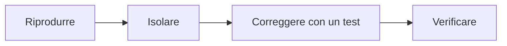

## Contenuti

- Tipi di test
- Copertura
- Debugging con metodo
- Il debugger di VS Code
- Laboratorio
- Aspetti orientativi

## Tipi di test

- Unità, integrazione, sistema, accettazione
- Regressione ed esplorativi
- Piramide: molti test di unità, pochi test di sistema

## Copertura

- Righe eseguite almeno una volta dai test
- Indica dove mancano test, non se i test sono buoni
- Riga eseguita non vuol dire riga verificata

## Debugging con metodo

## Il debugger di VS Code

- `F9` punto di interruzione, `F5` avvia e continua
- `F10` passo successivo, `F11` entra, `Shift+F11` esce
- Pannello Variabili e Console di debug
- `launch.json`: `type: debugpy`, `program`, `args`

## Laboratorio

1. Kit con difetti: 22 test verdi, copertura 98%
2. Quattro segnalazioni degli utenti e due difetti nascosti
3. `python copertura.py`; 8 test

## Aspetti orientativi

- Tester e QA engineer
- Debugging: ipotesi, verifica, conclusione
