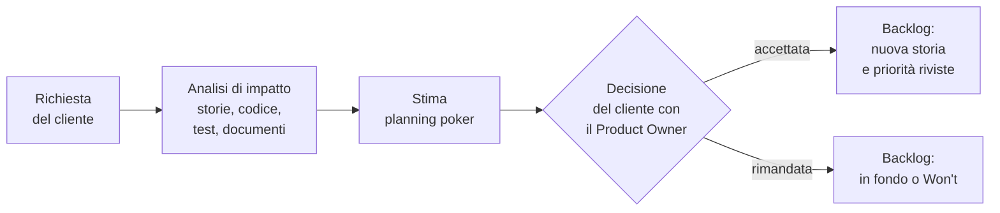

# Lezione 5.6: Pianificazione dello sprint 2

> Contenuto originale. Riferimenti: Ken Schwaber e Jeff Sutherland, "La Guida a Scrum" (2020), licenza CC BY-SA 4.0, https://scrumguides.org/scrum-guide.html ; Wikipedia, "Change request", https://en.wikipedia.org/wiki/Change_request . I materiali del laboratorio sono nella cartella `laboratorio`.

Obiettivo: pianificare il secondo sprint usando la velocità misurata, e gestire una richiesta di modifica del cliente valutandone l'impatto e ripianificando il backlog.

## 5.6.1 Pianificare con i dati

Nello sprint 1 la capacità era una stima. Ora il team conosce la propria **velocità** (lezione 5.4) e la usa come capacità dello sprint 2, con due correzioni ragionevoli:

- se lo sprint 2 ha meno lezioni di sviluppo, la capacità si riduce in proporzione (nel corso: 2 lezioni dopo la pianificazione invece di 3)
- se la retrospettiva ha individuato cause di rallentamento risolte (per esempio l'installazione degli strumenti), si può prevedere un piccolo aumento, non un salto

Le storie non completate nello sprint 1 tornano nel backlog: il Product Owner decide se restano in cima. La loro stima si rivede solo se il team ha scoperto che era sbagliata; il lavoro già fatto sul loro ramo non si perde.

## 5.6.2 Richieste di modifica

Nei progetti reali il cliente cambia idea, e spesso ha ragione: vedendo il prodotto capisce meglio che cosa gli serve. I metodi agili accolgono i cambiamenti ("rispondere al cambiamento più che seguire un piano", lezione 3.2), ma **non gratuitamente**: ogni richiesta ha un costo, e il cliente deve decidere che cosa sacrificare.

Diagramma: il percorso di una richiesta di modifica.



L'**analisi di impatto** risponde a tre domande:

1. **che cosa cambia**: quali storie, quali parti del codice, quali test, quali documenti;
2. **quanto costa**: la stima della nuova storia;
3. **che cosa si rimanda** per farle spazio, a parità di tempo (il triangolo dei vincoli, lezione 1.1).

Nel modello a cascata la stessa richiesta aveva causato 13 giorni di ritardo (lezione 3.1). In un progetto agile arriva tra uno sprint e l'altro e cambia solo il backlog: il lavoro già fatto e integrato resta valido.

Una buona analisi cerca anche il modo di ridurre l'impatto. Esempio: per prenotare "per ore di lezione" non serve cambiare il formato dei dati; basta tradurre le ore in orari prima di registrare la prenotazione, e tutti i controlli esistenti continuano a valere.

## 5.6.3 Laboratorio

Tempo indicativo: 60 minuti. Cartella di lavoro: il repository del team; i materiali sono in `C:\corso-impresa\lab56`, gli script delle lezioni precedenti nelle rispettive cartelle.

### Parte 1: la richiesta del cliente (15 minuti)

Il docente consegna `richiesta_cliente_sprint2.md` (prenotare per ore di lezione). Ogni team compila `analisi_impatto.md` (in `docs/modifiche/RM-01.md`): storia con criteri di accettazione, parti del prodotto che cambiano, rischi.

### Parte 2: stima e decisione (15 minuti)

1. Planning poker sulla nuova storia e sulle storie ancora da stimare (`planning_poker.py`, lezione 3.3).
2. Il Product Owner propone al cliente che cosa rimandare; il cliente decide. Le decisioni si scrivono nell'analisi di impatto e nel backlog (nuova storia US-16, priorità riviste con `priorita.py` se serve).

### Parte 3: pianificazione (20 minuti)

1. Capacità dalla velocità dello sprint 1:

```powershell
python C:\corso-impresa\lab54\metriche_sprint.py confronta docs\sprint1.md
```

```text
Sprint                   Pianificati  Completati     %
sprint1                           10           7   70%
Capacità proposta per il prossimo sprint (media delle velocità): 7 punti
```

2. Scelta delle storie, obiettivo, controllo e creazione dello Sprint Backlog:

```powershell
python C:\corso-impresa\lab51\pianifica_sprint.py docs\backlog.md --numero 2 --capacita 6 --storie US-03 US-16 --obiettivo "Prenotare per ore di lezione e cancellare le proprie prenotazioni"
```

Nell'esempio la capacità è ridotta da 7 a 6 punti perché lo sprint 2 ha meno lezioni di sviluppo; il team può motivare una scelta diversa.

3. Compiti in `docs/sprint2.md`, backlog e board aggiornati, primo punto del burndown con `--lezioni 2`:

```powershell
python C:\corso-impresa\lab53\burndown.py docs\burndown2.csv --backlog docs\backlog.md --sprint docs\sprint2.md --registra 5.6 --lezioni 2
```

### Parte 4: azioni della retrospettiva (10 minuti)

Rilettura delle azioni della retrospettiva dello sprint 1 (`docs/retrospettiva_sprint1.md`): chi le segue in questo sprint e come si verificherà che hanno funzionato.

## 5.6.4 Aspetti orientativi (discussione)

- Gestire le richieste di modifica è una parte importante del lavoro di project manager, Product Owner e commerciali: serve equilibrio tra la soddisfazione del cliente e la sostenibilità del lavoro del team.
- Saper dire "si può fare, e costa questo" invece di "sì" o "no" è una competenza professionale preziosa.
- Domanda: che cosa ha scelto di rimandare il cliente? Il team era d'accordo?
