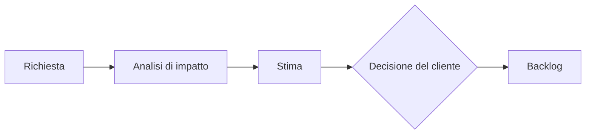

## Lezione 5.6: Pianificazione dello sprint 2

Modulo 5: Due sprint di sviluppo. Informatica per l'Impresa e Soft Skills Digitale

---

## Pianificare con i dati

- Capacità dalla velocità dello sprint 1
- Correzione per le lezioni disponibili
- Le storie non finite tornano nel backlog

---

## Richieste di modifica

- Che cosa cambia, quanto costa, che cosa si rimanda

---

## La richiesta del cliente

- Prenotare per ore di lezione: dalla 2ª alla 3ª ora
- Nel modello a cascata: 13 giorni di ritardo (lezione 3.1)
- Qui: una nuova storia; il formato dei dati può restare uguale

---

## Laboratorio

1. Analisi di impatto RM-01
2. Planning poker e decisione del cliente
3. `metriche_sprint.py confronta`, `pianifica_sprint.py --numero 2`, burndown con `--lezioni 2`
4. Azioni della retrospettiva 1

---

## Aspetti orientativi

- "Si può fare, e costa questo"
- Che cosa ha rimandato il cliente?
