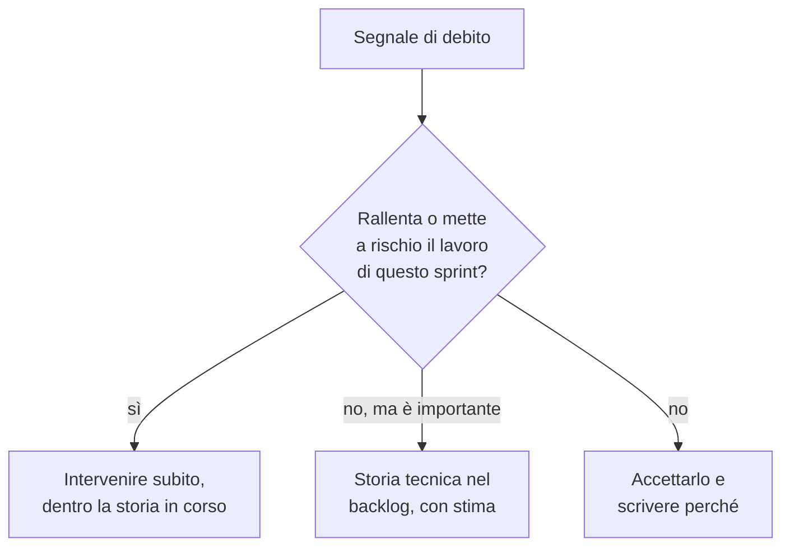

# Lezione 5.7: Sviluppo e integrazione dello sprint 2

> Contenuto originale. Riferimenti: Wikipedia, "Technical debt", https://en.wikipedia.org/wiki/Technical_debt ; Wikipedia, "Code refactoring", https://en.wikipedia.org/wiki/Code_refactoring ; documentazione di Python, modulo ast, https://docs.python.org/3/library/ast.html . I materiali del laboratorio sono nella cartella `laboratorio`.

Obiettivo: lavorare in autonomia sullo sprint 2, gestire gli imprevisti, riconoscere il debito tecnico e decidere come trattarlo.

## 5.7.1 Il team autonomo

Nello sprint 2 il team conosce strumenti, regole e velocità: il docente interviene solo come cliente e per gli ostacoli che il team non può risolvere. L'autonomia si vede da comportamenti concreti:

- il daily scrum si svolge senza che nessuno lo ricordi
- le revisioni del codice si fanno entro la lezione
- chi finisce un compito sceglie il successivo dalla board, oppure aiuta chi è bloccato
- `main` resta sempre funzionante

## 5.7.2 Imprevisti

| Imprevisto | Risposta |
|---|---|
| Una storia si rivela più grande della stima | dirlo subito nel daily scrum; con il Product Owner, dividerla o ridurla, mantenendo l'obiettivo dello sprint |
| Un membro assente | la board mostra il suo lavoro; chi lo riprende legge il ramo e i commit |
| Un difetto grave trovato in `main` | ha la precedenza: segnalazione, test che lo riproduce, correzione (lezione 5.5) |
| Il cliente chiede una modifica durante lo sprint | il Product Owner la annota nel backlog; si valuta nella prossima pianificazione, salvo urgenze vere |
| Conflitto tra membri del team | regole dell'accordo di team (lezione 1.2); se non basta, il docente |

L'obiettivo dello sprint guida le scelte: se non tutto si può fare, si sacrifica ciò che non serve all'obiettivo.

## 5.7.3 Il debito tecnico

- **Debito tecnico**
  espressione introdotta da Ward Cunningham nel 1992 per indicare il costo futuro delle scorciatoie prese oggi: codice scritto in fretta, test mancanti, duplicazioni, documentazione non aggiornata. Come un debito finanziario, genera "interessi": ogni modifica successiva diventa più lenta e rischiosa, finché non lo si "ripaga" migliorando il codice.

Non tutto il debito è un errore: a volte è una scelta consapevole (consegnare in tempo per una dimostrazione), purché sia **registrata** e ripagata presto. Il problema è il debito inconsapevole, che cresce senza che nessuno lo veda.

Segnali tipici:

- funzioni troppo lunghe, o con molti parametri
- codice duplicato in più punti
- funzioni senza documentazione
- commenti "TODO" e "FIXME" lasciati in sospeso
- parti senza test (lezione 5.5)

Diagramma: che cosa fare di un segnale.



Ripagare il debito significa fare **refactoring**: migliorare la struttura del codice senza cambiarne il comportamento. I test sono ciò che rende il refactoring sicuro: se prima e dopo passano tutti, il comportamento non è cambiato.

## 5.7.4 Laboratorio

Tempo indicativo: 60 minuti. Cartella di lavoro: il repository del team; lo script è in `C:\corso-impresa\lab57`.

### Parte 1: daily scrum e burndown (10 minuti)

Punto del burndown (`--registra 5.7`, file `burndown2.csv`, `--lezioni 2`) e daily scrum, senza indicazioni del docente.

### Parte 2: sviluppo e integrazione (40 minuti)

Sviluppo delle storie dello sprint 2 con il flusso delle lezioni 5.2 e 5.3. Il docente, come cliente, risponde alle domande sui criteri; lo Scrum Master segue gli ostacoli.

### Parte 3: registro del debito tecnico (10 minuti)

```powershell
python C:\corso-impresa\lab57\debito_tecnico.py . --registro docs\debito_tecnico.md
```

```text
logica.py:47    lunghezza       funzione nuova_prenotazione di 27 righe (massimo 25): dividerla?
logica.py:47    parametri       funzione nuova_prenotazione con 8 parametri (massimo 6)
prenotazioni.py:37    documentazione  funzione comando_aule senza docstring
prenotazioni.py:47    documentazione  funzione comando_prenota senza docstring

File analizzati: 3; segnali: 4
Registro scritto in docs\debito_tecnico.md
```

L'esempio è l'analisi del kit di partenza: anche il codice fornito ha del debito. Per ogni segnale il team compila la colonna "Decisione" del registro (subito, storia tecnica, accettato con motivazione) e registra il file con un commit.

Come si trovano le funzioni senza documentazione:

```python
for nodo in ast.walk(albero):
    if isinstance(nodo, (ast.FunctionDef, ast.AsyncFunctionDef, ast.ClassDef)):
        if ast.get_docstring(nodo) is None and not nodo.name.startswith("_"):
            ...
```

- `ast.parse` trasforma il testo del programma nel suo **albero sintattico**: una struttura in cui ogni funzione, classe, istruzione è un nodo
- `ast.walk` visita tutti i nodi; `isinstance` riconosce le definizioni di funzioni e classi
- `ast.get_docstring` restituisce la docstring o `None`; le funzioni il cui nome inizia con `_` sono considerate interne e non vengono segnalate
- per la lunghezza si usano `lineno` ed `end_lineno`, la prima e l'ultima riga della funzione; i commenti in sospeso si cercano con un'espressione regolare, riga per riga

Test: `python test_debito_tecnico.py` (12 test).

## 5.7.5 Aspetti orientativi (discussione)

- Nelle aziende il debito tecnico è un tema costante nelle discussioni tra sviluppatori e management: spiegare perché conviene "spendere tempo" per migliorare codice che funziona richiede argomenti chiari, non solo tecnici.
- Molti sviluppatori esperti considerano la capacità di lasciare il codice più pulito di come lo si è trovato una delle qualità professionali più importanti.
- Domanda: quale scorciatoia ha preso il team in questi sprint? Andrebbe ripagata?
