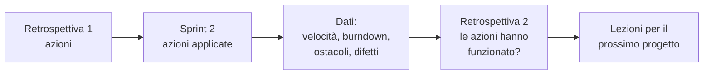

# Lezione 5.8: Revisione e retrospettiva dello sprint 2

> Contenuto originale. Riferimenti: Ken Schwaber e Jeff Sutherland, "La Guida a Scrum" (2020), licenza CC BY-SA 4.0, https://scrumguides.org/scrum-guide.html (Sprint Review, Sprint Retrospective). I materiali del laboratorio sono nella cartella `laboratorio`; gli script sono quelli delle lezioni 5.3 e 5.4.

Obiettivo: chiudere il secondo sprint con la revisione finale delle storie, confrontare i due sprint con i dati raccolti e misurare se le azioni di miglioramento hanno funzionato.

## 5.8.1 La revisione finale

La revisione dello sprint 2 segue le regole della lezione 5.4, con due differenze:

- il cliente vede il **prodotto nel suo insieme**, non solo le storie dello sprint: una breve dimostrazione del percorso completo (prenotare, vedere le prenotazioni del giorno, cancellare) prima delle novità
- il Product Owner presenta lo **stato del backlog**: che cosa è stato fatto, che cosa resta, che cosa entrerà nella versione 1.0.0 che si rilascerà nel modulo 6

## 5.8.2 Misurare il miglioramento

Una retrospettiva serve se le sue azioni cambiano qualcosa. Per saperlo si confrontano dati, non impressioni.

| Domanda | Dati per rispondere |
|---|---|
| La pianificazione è diventata più realistica? | percentuale di punti completati sui pianificati nei due sprint (`metriche_sprint.py confronta`) |
| Il lavoro scorre meglio? | forma dei due burndown: una discesa regolare è meglio di una linea piatta che crolla alla fine |
| La qualità è migliorata? | difetti trovati dopo l'integrazione, numero di test, segnali di debito tecnico |
| Le azioni della retrospettiva 1 sono state fatte? Hanno avuto effetto? | registro dei daily scrum, osservazioni del team |

Attenzione alle conclusioni affrettate: una velocità più alta nel secondo sprint può dipendere da storie stimate in modo diverso, non da un team più efficiente. I numeri aprono la discussione, non la chiudono.

Diagramma: il ciclo di miglioramento che collega le retrospettive.



## 5.8.3 Laboratorio

Tempo indicativo: 60 minuti. Cartella di lavoro: il repository del team.

### Parte 1: chiusura e dati (10 minuti)

1. Ultimo punto del burndown (`--registra 5.8`, file `burndown2.csv`, `--lezioni 2`), integrazione delle storie fatte, test su `main`.
2. Chiusura dello sprint 2 e confronto:

```powershell
python C:\corso-impresa\lab54\metriche_sprint.py chiudi docs\backlog.md docs\sprint2.md
python C:\corso-impresa\lab54\metriche_sprint.py confronta docs\sprint1.md docs\sprint2.md
```

```text
Sprint                   Pianificati  Completati     %
sprint1                           10           7   70%
sprint2                            6           6  100%

Variazione della velocità rispetto allo sprint precedente: -1 punti
Capacità proposta per il prossimo sprint (media delle velocità): 6 punti
```

Nell'esempio la velocità scende di un punto, ma lo sprint 2 aveva una lezione di sviluppo in meno e il team ha completato tutto ciò che aveva pianificato: la pianificazione è diventata più realistica.

### Parte 2: revisione finale (25 minuti)

Ogni team presenta in 4 minuti, più 1 minuto di domande, con la scaletta della lezione 5.4 e la dimostrazione del percorso completo. Il docente, come cliente, dice quali storie accetta per la versione 1.0.0.

### Parte 3: retrospettiva e confronto (25 minuti)

1. Retrospettiva con il modello della lezione 5.4 (`docs/retrospettiva_sprint2.md`), partendo dalla verifica delle azioni della retrospettiva 1.
2. Compilazione di `confronto_sprint.md` (in `docs/confronto_sprint.md`).
3. Commit su `main` di tutti i documenti.

I due confronti e le retrospettive saranno il materiale della retrospettiva di progetto (lezione 6.3) e della riflessione personale per il capolavoro.

## 5.8.4 Aspetti orientativi (discussione)

- Misurare il proprio lavoro con dati, e usarli per migliorare senza cercare colpevoli, è il principio del miglioramento continuo usato nella gestione della qualità.
- Il ruolo dell'**agile coach** consiste proprio nell'aiutare team e organizzazioni a migliorare il modo di lavorare, a partire da retrospettive e metriche.
- Domanda: quale cambiamento tra il primo e il secondo sprint è stato più visibile? Da che cosa si capisce?
