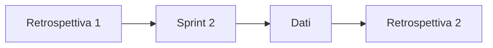

## Lezione 5.8: Revisione e retrospettiva dello sprint 2

Modulo 5: Due sprint di sviluppo. Informatica per l'Impresa e Soft Skills Digitale

---

## La revisione finale

- Il prodotto nel suo insieme, poi le novità
- Stato del backlog e contenuto della versione 1.0.0

---

## Misurare il miglioramento

- Percentuale completata, forma del burndown
- Difetti dopo l'integrazione, test, debito tecnico
- Azioni della retrospettiva 1: fatte? efficaci?
- I numeri aprono la discussione, non la chiudono

---

## Il ciclo di miglioramento

---

## Laboratorio

1. `metriche_sprint.py chiudi` e `confronta`
2. Revisione finale
3. Retrospettiva e confronto tra gli sprint

---

## Aspetti orientativi

- Miglioramento continuo basato sui dati
- Agile coach
- Quale cambiamento è stato più visibile?
