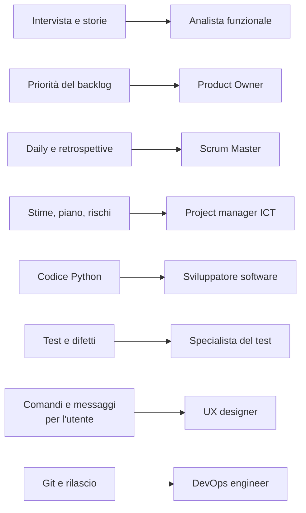
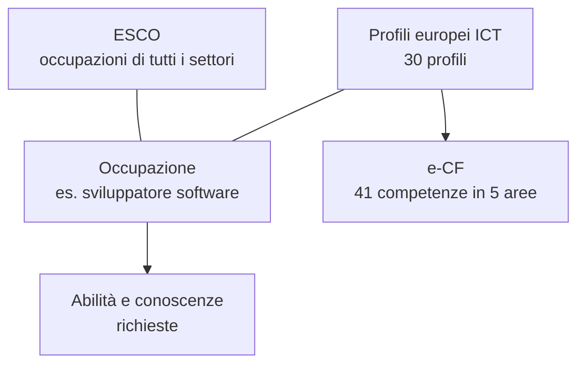

# Lezione 7.1: Professioni del progetto ICT

> Contenuto originale. Riferimenti: Commissione europea, ESCO, classificazione europea di abilità, competenze, qualifiche e occupazioni, https://esco.ec.europa.eu/it ; CEN, CWA 16458-1:2018 "European ICT Professional Role Profiles", https://www.cencenelec.eu/media/CEN-CENELEC/AreasOfWork/CEN%20sectors/Digital%20Society/CWA%20Download%20Area/ICT_SkillsWS/16458-1.pdf (citato per i soli nomi dei profili); EXIN, sintesi dell'e-CF, https://www.exin.com/e-cf-competences/ . I materiali del laboratorio sono nella cartella `laboratorio`.

Obiettivo: collegare i ruoli e le attività svolte nel progetto alle professioni ICT reali, distinguere competenze tecniche e trasversali, usare i quadri europei (ESCO, profili europei delle professioni ICT, e-CF) per informarsi su una professione.

## 7.1.1 Dal progetto alle professioni

Nel progetto ogni studente ha ricoperto uno o più ruoli e svolto attività diverse. Le stesse attività, in un'azienda, sono il lavoro quotidiano di professioni precise.

Diagramma: attività del progetto e professioni corrispondenti.



| Professione | Che cosa fa | Nel progetto |
|---|---|---|
| Analista funzionale (business analyst) | raccoglie e descrive le esigenze del cliente, le traduce in requisiti | modulo 2: intervista, storie utente |
| Product Owner | decide che cosa sviluppare e in quale ordine, per massimizzare il valore | backlog e priorità, revisioni |
| Scrum Master | aiuta il team ad applicare Scrum e a rimuovere gli ostacoli | daily, retrospettive |
| Project manager ICT | pianifica tempi, costi e rischi, coordina le persone | modulo 3: piano, stime, rischi, preventivo |
| Sviluppatore software | progetta e scrive il codice, lo integra e lo mantiene | modulo 5 |
| Specialista del test | progetta ed esegue i test, segnala i difetti | test, debugging, segnalazioni |
| UX designer | studia come le persone usano il prodotto e progetta l'interazione | comandi, messaggi, manuale |
| DevOps engineer | automatizza integrazione, rilascio ed esercizio | Git, modulo 6: rilascio |

In un'azienda piccola una persona copre più ruoli, come nei team del corso; in una grande ogni ruolo può essere un gruppo di persone. Alcune professioni (Product Owner, project manager) si raggiungono di solito dopo qualche anno di esperienza tecnica.

## 7.1.2 Competenze tecniche e trasversali

- **Competenze tecniche** (hard skill)
  conoscenze e abilità specifiche di un mestiere: un linguaggio di programmazione, Git, le tecniche di test.
- **Competenze trasversali** (soft skill)
  capacità utili in qualunque lavoro: comunicare, collaborare, risolvere problemi, organizzare il tempo.

Le competenze tecniche cambiano in fretta: un linguaggio oggi richiesto può esserlo meno tra dieci anni. Le competenze trasversali durano e rendono più facile imparare quelle tecniche nuove. Gli annunci di lavoro ICT chiedono entrambe (lezione 7.3).

## 7.1.3 I quadri europei

Per descrivere professioni e competenze in modo confrontabile tra Paesi e aziende esistono quadri di riferimento europei.

- **ESCO** (European Skills, Competences, Qualifications and Occupations)
  classificazione della Commissione europea, in 28 lingue, con oltre 3000 occupazioni collegate ai codici internazionali ISCO-08. Per ogni occupazione indica descrizione, abilità e conoscenze essenziali e facoltative. Si consulta da https://esco.ec.europa.eu/it , sezione "Classificazione", "Occupazioni".
- **Profili europei delle professioni ICT** (European ICT Professional Role Profiles, CWA 16458-1:2018)
  30 profili professionali tipici del settore ICT, fra cui Developer, Test Specialist, Business Analyst, Project Manager, Product Owner, Scrum Master, DevOps Expert. Per ciascuno descrivono missione, risultati attesi, compiti e competenze.
- **e-CF** (e-Competence Framework, norma europea EN 16234-1)
  41 competenze dei professionisti ICT, organizzate in 5 aree: Plan (pianificare), Build (realizzare), Run (gestire l'esercizio), Enable (abilitare), Manage (governare). I profili europei sono descritti con le competenze dell'e-CF.

Diagramma: come si collegano i quadri.



Questi quadri si usano per scrivere annunci di lavoro, progettare corsi e certificazioni, confrontare qualifiche di Paesi diversi. Per uno studente servono a scoprire che cosa fa davvero una professione e quali competenze chiede.

## 7.1.4 Laboratorio

Tempo indicativo: 40 minuti. Cartella di lavoro `C:\corso-impresa\lab71`, con i file della cartella `laboratorio`.

### Parte 1: le attività del progetto (10 minuti)

Ogni studente risponde al questionario: per ognuna delle 12 attività del progetto, quanto gli è piaciuta, da 1 a 4. Conta l'interesse, non quanto si è stati bravi.

```powershell
python professioni_ict.py --salva risposte.csv --scheda scheda_professioni.md
```

```text
Quanto ti è piaciuto, nel progetto... (1 = per niente, 4 = molto)
  intervistare il cliente e capire le sue esigenze: 3
  scrivere storie utente e criteri di accettazione: 2
  ...

Professione                               Affinità
Sviluppatore software                         3.67
DevOps engineer                               3.33
Specialista del test (tester)                    3
...
Scrum Master                                  1.33
```

- `--salva` scrive le risposte in un file CSV, che si può riusare con `--risposte risposte.csv` senza rifare il questionario
- `--scheda` scrive una scheda Markdown con le attività preferite e le tre professioni più affini
- l'output di esempio si ottiene con `python professioni_ict.py --risposte risposte_esempio.csv`

Come si calcola e si ordina l'affinità:

```python
livelli = [risposte[a] for a in p["attivita"]]
risultati.append((round(sum(livelli) / len(livelli), 2), p))
...
return sorted(risultati, key=lambda r: (-r[0], r[1]["nome"]))
```

- ogni professione in `professioni.json` ha un elenco di attività; l'affinità è la media dei livelli dati a quelle attività
- `sorted` con `key` ordina per una chiave calcolata: la tupla `(-affinità, nome)` mette prima le affinità più alte (il segno meno inverte l'ordine) e, a parità, ordina per nome
- `professioni.json` si può modificare: aggiungere una professione o cambiare le attività associate, senza toccare il programma

Test: `python test_professioni_ict.py` (13 test).

### Parte 2: ricerca in ESCO (20 minuti)

Per due professioni della propria scheda (una delle prime tre e una scelta liberamente):

1. cercare in ESCO il termine indicato nella scheda (riga "Da cercare in ESCO") e scegliere l'occupazione più vicina
2. annotare nella scheda, sezione "Che cosa ho scoperto in ESCO": descrizione in una frase, tre abilità essenziali, una abilità già esercitata nel progetto e una ancora da sviluppare

### Parte 3: confronto (10 minuti)

A coppie: ciascuno presenta in due minuti una professione all'altro, collegandola a un episodio del progetto (la riflessione della lezione 6.3 aiuta).

## 7.1.5 Aspetti orientativi (discussione)

- Lo stesso interesse porta a professioni diverse: chi ama il test può diventare tester, sviluppatore, specialista della sicurezza.
- Le professioni ICT esistono in tutti i settori, non solo nelle aziende informatiche: banche, ospedali, pubblica amministrazione, industria.
- Domanda: quale professione non si conosceva prima del corso? Quale si vorrebbe vedere da vicino, per esempio in un'esperienza di scuola-lavoro?
