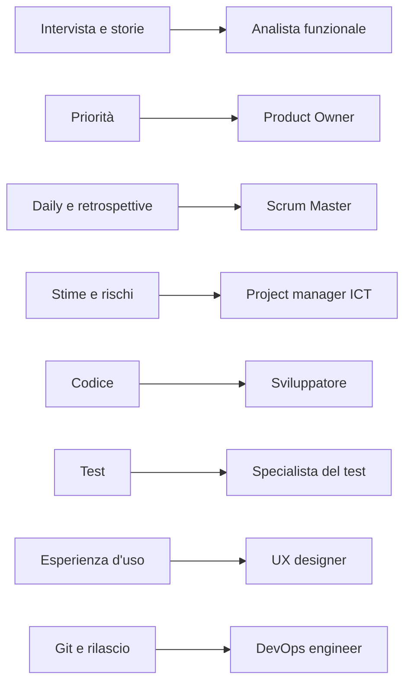

## Contenuti

- Dal progetto alle professioni
- Una persona, più ruoli
- Competenze tecniche e trasversali
- I quadri europei
- Laboratorio
- Aspetti orientativi

## Dal progetto alle professioni

## Una persona, più ruoli

- Azienda piccola: più ruoli per persona, come nei team del corso
- Azienda grande: un ruolo, a volte un gruppo
- Product Owner e project manager: di solito dopo esperienza tecnica

## Competenze tecniche e trasversali

- Tecniche: linguaggi, Git, test; cambiano in fretta
- Trasversali: comunicare, collaborare, risolvere problemi; durano
- Gli annunci chiedono entrambe

## I quadri europei

| Quadro | Che cosa descrive |
|---|---|
| ESCO | oltre 3000 occupazioni, 28 lingue |
| Profili europei ICT | 30 profili: Developer, Test Specialist, Product Owner... |
| e-CF (EN 16234-1) | 41 competenze in 5 aree: Plan, Build, Run, Enable, Manage |

## Laboratorio

1. `professioni_ict.py`: questionario e scheda
2. Ricerca di due professioni in ESCO
3. Presentazione a coppie

## Aspetti orientativi

- Lo stesso interesse porta a professioni diverse
- Professioni ICT in tutti i settori
- Quale professione si vorrebbe vedere da vicino?
