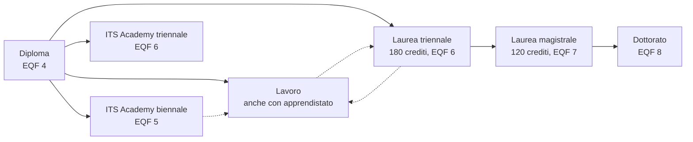

# Lezione 7.2: Percorsi dopo il diploma

> Contenuto originale. Riferimenti: Regione Lazio, "Gli ITS Academy", https://www.regione.lazio.it/cittadini/scuola-universita/istituti-tecnici-superiori ; Universitaly (Ministero dell'Università e della Ricerca), https://www.universitaly.it/ ; AlmaLaurea, https://www.almalaurea.it/ ; Unioncamere, Sistema Informativo Excelsior, https://excelsior.unioncamere.net/ ; Piattaforma Unica, https://unica.istruzione.gov.it/it ; dati del monitoraggio nazionale INDIRE 2025 sugli ITS Academy riportati da Orizzonte Scuola, https://www.orizzontescuola.it/its-academy-a-un-anno-dal-diploma-l84-trova-lavoro-il-93-in-un-settore-coerente-con-il-percorso-di-studi-i-dati-di-indire/ . I materiali del laboratorio sono nella cartella `laboratorio`.

Obiettivo: conoscere le strade possibili dopo il diploma (ITS Academy, università, lavoro e apprendistato), sapere dove cercare informazioni affidabili, confrontare due percorsi con criteri personali e fonti verificabili.

## 7.2.1 Le strade dopo il diploma

Il diploma di istruzione secondaria superiore corrisponde al livello 4 dell'**EQF** (European Qualifications Framework), il quadro europeo che rende confrontabili i titoli di studio dei diversi Paesi in 8 livelli.

Diagramma: le strade principali e i livelli EQF dei titoli.



- **ITS Academy**
  scuole di alta specializzazione tecnologica, costituite come fondazioni da scuole, università, imprese ed enti. Percorsi biennali (almeno 1800 ore, livello EQF 5) o triennali (almeno 3000 ore, livello EQF 6), con almeno il 35% delle ore in stage e tirocini in azienda e frequenza obbligatoria per almeno l'80% delle ore. Nel Lazio le fondazioni sono 16, in nove aree tecnologiche, fra cui "Tecnologia dell'informazione, della comunicazione e dei dati" (fonte: Regione Lazio).
- **Università**
  laurea triennale (180 crediti formativi, CFU), poi eventualmente laurea magistrale (120 CFU) e dottorato. Un credito corrisponde a circa 25 ore di lavoro dello studente, fra lezioni e studio personale. Per l'informatica le classi di laurea più diffuse sono L-31 (Scienze e tecnologie informatiche) e L-8 (Ingegneria dell'informazione).
- **Lavoro**
  subito dopo il diploma, anche con un contratto di **apprendistato**, che unisce lavoro e formazione. L'apprendistato di alta formazione e ricerca permette di conseguire anche un titolo ITS, una laurea o un dottorato lavorando.

Le strade non si escludono: si può lavorare e poi iscriversi all'università, passare da un ITS al lavoro e poi a una laurea.

## 7.2.2 Dove informarsi

| Fonte | Chi la pubblica | Che cosa offre |
|---|---|---|
| Piattaforma Unica, https://unica.istruzione.gov.it/it | Ministero dell'Istruzione e del Merito | sezione per l'orientamento, E-Portfolio dello studente |
| Universitaly, https://www.universitaly.it/ | Ministero dell'Università e della Ricerca, con CINECA | ricerca dei corsi di laurea per disciplina e sede, borse di studio |
| Regione Lazio, ITS Academy, https://www.regione.lazio.it/cittadini/scuola-universita/istituti-tecnici-superiori | Regione Lazio | fondazioni ITS del Lazio, offerta dei percorsi |
| AlmaLaurea, https://www.almalaurea.it/ | consorzio di università | profilo dei laureati e condizione occupazionale, per corso e ateneo |
| Excelsior, https://excelsior.unioncamere.net/ | Unioncamere con il Ministero del Lavoro | assunzioni programmate dalle imprese, previsioni dei fabbisogni per professione e titolo di studio |
| ESCO, https://esco.ec.europa.eu/it | Commissione europea | descrizione delle professioni e delle competenze (lezione 7.1) |

A queste si aggiungono le fonti dirette: open day e lezioni aperte, siti delle fondazioni ITS e degli atenei, colloqui con studenti ed ex studenti.

## 7.2.3 Leggere i dati con spirito critico

Esempio: secondo il monitoraggio nazionale INDIRE 2025, l'84% dei diplomati ITS Academy ha trovato lavoro entro 12 mesi, e il 93% di questi in un'attività coerente con il percorso. Prima di usare il dato conviene chiedersi:

- **di chi parla**: diplomati di tutti gli ITS d'Italia, di tutte le aree; per un ITS preciso o per l'area ICT il valore può essere diverso
- **quando**: percorsi conclusi negli anni precedenti al rapporto; il mercato del lavoro cambia
- **che cosa misura**: "occupato" comprende contratti di ogni tipo e durata
- **chi lo pubblica**: un ente pubblico di ricerca, un'associazione di categoria, un'azienda che vende un corso hanno interessi diversi

Le stesse domande valgono per i dati di AlmaLaurea sulle lauree e per qualunque classifica. Due dati di fonti diverse si confrontano solo se misurano la stessa cosa nello stesso modo.

## 7.2.4 Laboratorio

Tempo indicativo: 45 minuti. Cartella di lavoro `C:\corso-impresa\lab72`, con i file della cartella `laboratorio`.

### Parte 1: i miei criteri (10 minuti)

Ogni studente copia `criteri_esempio.csv` in `criteri.csv` e lo adatta: aggiunge, toglie o rinomina i criteri (sede e trasporti, possibilità di studiare all'estero, tempo libero...) e assegna a ognuno un peso da 1 a 5, secondo quanto conta per sé. Non esistono pesi giusti: sono le priorità personali.

### Parte 2: ricerca (20 minuti)

1. Scegliere due percorsi da confrontare: per esempio un ITS Academy e una laurea, oppure due lauree, oppure un percorso di studio e un lavoro in apprendistato.
2. Copiare `percorsi_esempio.csv` in `percorsi.csv` e, per ogni percorso e ogni criterio, scrivere l'informazione trovata, la fonte e un punteggio da 1 a 5.
3. La fonte è l'indirizzo web della pagina; per un open day o un colloquio si scrivono data e persona.

Il file si apre in VS Code come testo: i campi che contengono una virgola vanno tra virgolette, come negli esempi.

### Parte 3: confronto (15 minuti)

```powershell
python confronta_percorsi.py criteri.csv percorsi.csv --scheda confronto.md
```

Con i file di esempio:

```text
ATTENZIONE: ITS Academy area ICT (biennale), interesse: fonte senza indirizzo web ("open day della fondazione, 15 novembre"): va bene per un open day o un colloquio, annotare data e persona
...

ITS Academy area ICT (biennale)                50 su 65
Laurea in Informatica (L-31)                   48 su 65
Criteri da cui dipende la scelta: pratica, interesse
```

- ogni totale è la somma, criterio per criterio, di peso per punteggio; il massimo è 5 per la somma dei pesi
- se manca un'informazione, una fonte o un punteggio, il programma non calcola il confronto: un totale costruito su dati mancanti sembrerebbe affidabile senza esserlo
- "Criteri da cui dipende la scelta" elenca i criteri il cui peso, aumentato o diminuito di 1, cambia il percorso in testa

Come si cercano i criteri da cui dipende la scelta:

```python
in_testa = primo(totali(percorsi, pesi))
for criterio, peso in pesi.items():
    for nuovo in (peso - 1, peso + 1):
        if 1 <= nuovo <= 5 and primo(totali(percorsi, {**pesi, criterio: nuovo})) != in_testa:
```

- `{**pesi, criterio: nuovo}` crea un nuovo dizionario con tutti i pesi e un solo peso cambiato; quello originale non si modifica
- `primo` restituisce il percorso in testa, oppure `None` in caso di pareggio: anche un pareggio conta come cambiamento

Nell'esempio, una differenza di 2 punti su 65 dipende dai pesi di due criteri: il risultato non decide al posto dello studente, indica che cosa approfondire. Anche le informazioni vanno riviste: per la laurea, il dato sull'occupazione è ancora generico ("dati per corso e ateneo") e va cercato in AlmaLaurea per un corso preciso.

Test: `python test_confronta_percorsi.py` (15 test).

Lo studente completa la sezione "Che cosa ne penso" della scheda `confronto.md`, che si riprende nella lezione 7.4.

## 7.2.5 Aspetti orientativi (discussione)

- La matrice di decisione è la stessa usata nel modulo 2 per le priorità del cliente: uno strumento per rendere esplicite le ragioni di una scelta, non per sostituirla.
- Le informazioni cambiano ogni anno (bandi, requisiti, scadenze): la ricerca va ripetuta in quinta, con le date dei bandi.
- Domanda: quale informazione trovata ha sorpreso di più? Quale criterio è risultato più difficile da valutare?
