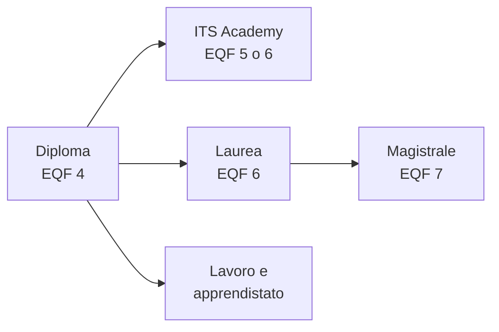

## Contenuti

- Le strade dopo il diploma
- ITS Academy
- Università e lavoro
- Dove informarsi
- Leggere i dati
- Laboratorio
- Aspetti orientativi

## Le strade dopo il diploma

## ITS Academy

- Biennali (EQF 5) o triennali (EQF 6)
- Almeno il 35% delle ore in stage e tirocini
- Lazio: 16 fondazioni, area "Tecnologia dell'informazione, della comunicazione e dei dati"

## Università e lavoro

- Laurea: 180 CFU; magistrale: 120 CFU
- Informatica: classi L-31 e L-8
- Apprendistato: lavoro e formazione, anche per un titolo

## Dove informarsi

- Unica, Universitaly, Regione Lazio
- AlmaLaurea, Excelsior, ESCO
- Open day, lezioni aperte, ex studenti

## Leggere i dati

- Di chi parla? Quando? Che cosa misura? Chi lo pubblica?
- Esempio: 84% dei diplomati ITS occupato entro 12 mesi (INDIRE 2025, dato nazionale)

## Laboratorio

1. I miei criteri e i pesi
2. Ricerca su due percorsi, con le fonti
3. `confronta_percorsi.py`: totali e criteri da cui dipende la scelta

## Aspetti orientativi

- La matrice di decisione rende esplicite le ragioni
- Le informazioni cambiano ogni anno
- Quale informazione ha sorpreso di più?
