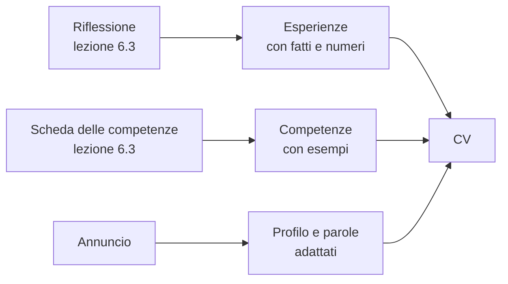

# Lezione 7.3: Candidarsi: CV e colloquio

> Contenuto originale. Riferimenti: Commissione europea, Europass, "Crea il tuo CV Europass", https://europass.europa.eu/it/create-europass-cv , e domande frequenti sull'uso come ospite, https://europass.europa.eu/en/faq?page=2 ; metodo STAR, Wikipedia (in inglese), https://en.wikipedia.org/wiki/Situation,_task,_action,_result . Gli annunci e i CV del laboratorio sono di fantasia. I materiali del laboratorio sono nella cartella `laboratorio`.

Obiettivo: leggere un annuncio di lavoro o di stage, scrivere un CV efficace e una breve lettera di presentazione, prepararsi al colloquio raccontando le proprie esperienze con il metodo STAR, curare la propria presenza online.

## 7.3.1 Leggere un annuncio

Un annuncio ha di solito quattro parti: chi cerca (l'azienda), che cosa si farà (attività), che cosa si chiede (requisiti, a volte divisi in obbligatori e graditi), che cosa si offre (contratto, durata, sede).

- I requisiti **obbligatori** sono il minimo; quelli **graditi** descrivono il candidato ideale, che spesso non esiste. Si può rispondere anche senza averli tutti.
- Le parole dell'annuncio sono quelle che il selezionatore cerca nel CV; molte aziende usano anche programmi che selezionano i CV per parole chiave.
- Per uno studente le forme più frequenti sono lo **stage** (tirocinio formativo, con rimborso spese) e l'**apprendistato** (contratto di lavoro con formazione).

## 7.3.2 Il CV

Il **curriculum vitae** (CV) presenta in una o due pagine chi si è, che cosa si sa fare e che cosa si cerca. Il formato **Europass** è un modello europeo diffuso, utile perché ordinato e riconosciuto; non è obbligatorio.

Sezioni di un primo CV:

- contatti: nome, e-mail, telefono, città
- profilo: due o tre righe su chi si è e che cosa si cerca, adattate all'annuncio
- istruzione e formazione: dalla più recente
- esperienze e progetti: per uno studente contano i progetti scolastici, il volontariato, i lavori estivi
- competenze: tecniche e trasversali, con esempi
- lingue: con i livelli del Quadro comune europeo di riferimento (A1-C2)
- autorizzazione al trattamento dei dati personali, che molti annunci in Italia chiedono

Regole di scrittura:

- **fatti, non aggettivi**: "Scrum Master nello sprint 2, il team ha completato 6 storie su 7" invece di "ottime capacità organizzative"
- **verbi d'azione**: sviluppato, condotto, risolto, presentato
- **distinguere il proprio contributo** da quello del team
- **dati personali solo se servono**: data di nascita, stato civile, codice fiscale e fotografia non servono a valutare le competenze; si indicano solo se l'annuncio li chiede
- un indirizzo e-mail semplice, con nome e cognome

Diagramma: dal progetto del corso al CV.



## 7.3.3 La lettera di presentazione

Accompagna il CV e spiega perché si risponde proprio a quell'annuncio. Tre paragrafi brevi:

1. per quale posizione ci si candida e dove si è visto l'annuncio
2. perché si è adatti: due esperienze collegate ai requisiti principali
3. disponibilità a un colloquio e saluti

Si scrive per ogni annuncio: una lettera generica si riconosce subito.

## 7.3.4 Il colloquio

Il colloquio serve all'azienda per capire se il candidato è adatto, e al candidato per capire se l'azienda e il ruolo fanno per lui o per lei.

- **Prima**: informarsi sull'azienda, rileggere annuncio e CV, preparare esempi e domande da fare.
- **Durante**: ascoltare la domanda fino in fondo, rispondere con esempi concreti, dire che cosa non si sa ancora e come lo si sta imparando.
- **Dopo**: annotare le domande ricevute; un breve messaggio di ringraziamento è apprezzato.

Le domande sulle esperienze ("mi racconti una volta in cui...") si preparano con il **metodo STAR**:

- **S**ituazione: il contesto, in una frase
- **T**ask (compito): che cosa si doveva ottenere
- **A**zione: che cosa si è fatto personalmente
- **R**isultato: com'è andata, con un dato se possibile, e che cosa si è imparato

Domande su stato civile, figli, religione, opinioni politiche o sindacali non riguardano le capacità professionali; l'articolo 8 dello Statuto dei lavoratori (legge 300/1970) vieta al datore di lavoro indagini su opinioni e fatti non rilevanti per la valutazione dell'attitudine professionale. Si può rispondere con calma riportando il discorso sulle competenze.

## 7.3.5 La presenza online

Chi seleziona spesso cerca il nome del candidato in rete.

- i profili pubblici sui social mostrano un'immagine di sé: conviene controllare che cosa vede chi non è tra gli amici
- un repository pubblico con progetti curati (README chiaro, codice leggibile) è un buon biglietto da visita per chi cerca lavoro nell'informatica
- i servizi professionali come LinkedIn e GitHub richiedono un'età minima nelle loro condizioni d'uso e un account personale: si valutano dopo il corso, con la famiglia se si è minorenni

## 7.3.6 Laboratorio

Tempo indicativo: 50 minuti. Cartella di lavoro `C:\corso-impresa\lab73`, con i file della cartella `laboratorio`. Nessun account: il CV si scrive in Markdown e, se si vuole, nell'editor Europass come ospite.

### Parte 1: CV in Markdown (20 minuti)

1. Copiare `cv_esempio.md` in `cv.md` e riscriverlo con i propri dati, usando la riflessione e la scheda delle competenze della lezione 6.3. In classe si possono omettere telefono e indirizzo.
2. Controllare:

```powershell
python cv_e_annuncio.py controlla cv.md
```

Con il CV di esempio `cv_da_migliorare.md`:

```text
DA SISTEMARE: manca la sezione "lingue"
DA SISTEMARE: ci sono ancora parti da completare ("...")
ATTENZIONE: data di nascita: non serve nel CV; si indica solo se l'annuncio lo chiede
ATTENZIONE: stato civile: non serve nel CV; si indica solo se l'annuncio lo chiede
ATTENZIONE: espressione generica "buone capacità": meglio un fatto (che cosa, dove, con quale risultato)
...
Da sistemare: 2; attenzione: 7
```

3. Confrontare il CV con uno dei due annunci di fantasia:

```powershell
python cv_e_annuncio.py annuncio annuncio_stage.md cv.md
```

```text
presente      Diploma tecnico in informatica (anche in corso) o percorso equivalente
presente      Conoscenza di base di Python
...
DA VERIFICARE Esperienza con framework web  (non trovate: framework, web)

Requisiti presenti nel CV: 7 su 8
```

Come si decide se un requisito è presente:

```python
radici_cv = {p[:RADICE] for p in re.findall(r"[a-z0-9+#]+", normalizza(testo_cv))}
chiavi = parole_chiave(requisito)
trovate = [c for c in chiavi if c[:RADICE] in radici_cv]
```

- `normalizza` porta il testo in minuscolo e toglie gli accenti, con `unicodedata`: "Capacità" e "capacita" diventano uguali
- le parole chiave sono le parole del requisito di almeno 4 lettere, escluse quelle comuni ("conoscenza", "della"...), più alcune sigle corte come "git" e "sql"
- si confrontano le prime 5 lettere (`RADICE`): "programmazione" e "programmare" coincidono; un requisito è presente se si trova almeno la metà delle sue parole chiave
- è un confronto tra parole, non tra significati: con `annuncio_apprendistato.md` il requisito "Disponibilità agli spostamenti in città" risulta presente perché il CV contiene "Città: Roma". Il programma aiuta a non dimenticare nulla; la decisione resta a chi legge

Test: `python test_cv_e_annuncio.py` (16 test).

4. Facoltativo: riportare il CV nell'editor Europass, raggiungibile da https://europass.europa.eu/it/create-europass-cv . Senza accedere si lavora come ospite: il CV si scarica sul proprio computer ma non resta salvato sul sito. Se l'editor chiede di creare un profilo, si usa la versione Markdown.

### Parte 2: simulazione di colloquio (25 minuti)

A gruppi di tre, con ruoli a rotazione: candidato, selezionatore, osservatore. Ogni colloquio dura 6 minuti.

1. Il selezionatore sceglie un annuncio e 5 domande da `domande_colloquio.md`, almeno una per gruppo.
2. Il candidato risponde; per le domande sulle esperienze usa il metodo STAR (esempio in fondo a `domande_colloquio.md`).
3. L'osservatore compila `griglia_colloquio.md` e la consegna al candidato.

### Parte 3: chiusura (5 minuti)

Ogni studente annota nella griglia ricevuta una cosa da migliorare per il prossimo colloquio.

## 7.3.7 Aspetti orientativi (discussione)

- CV e colloquio servono anche per le ammissioni: alcuni ITS Academy e corsi di laurea prevedono un colloquio motivazionale.
- Il progetto del corso è un'esperienza da CV: un prodotto reale, un team, un cliente, ruoli precisi.
- Domanda: quale domanda del colloquio è stata più difficile? Quale esperienza si è raccontata meglio con il metodo STAR?
