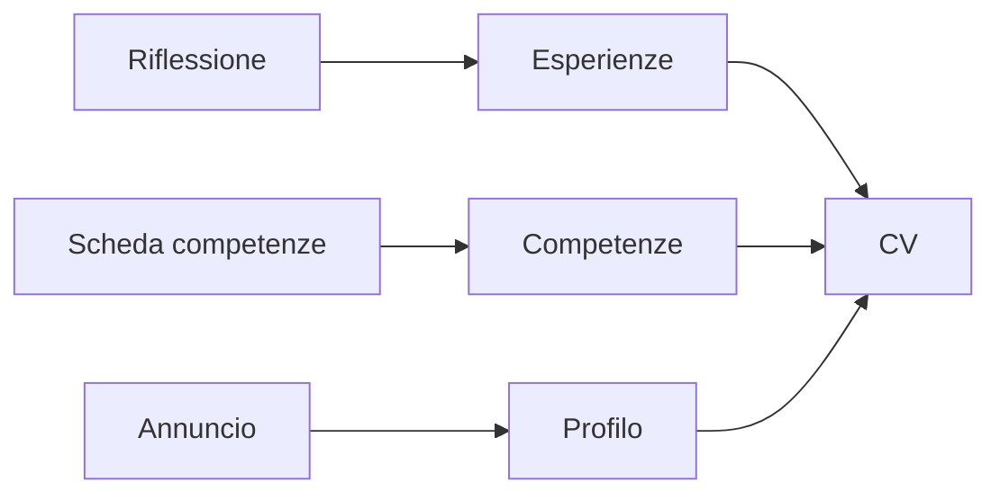

## Contenuti

- Leggere un annuncio
- Il CV
- Dal progetto al CV
- La lettera di presentazione
- Il colloquio e il metodo STAR
- La presenza online
- Laboratorio
- Aspetti orientativi

## Leggere un annuncio

- Azienda, attività, requisiti, offerta
- Requisiti obbligatori e graditi
- Le parole dell'annuncio sono quelle cercate nel CV

## Il CV

- Contatti, profilo, istruzione, esperienze e progetti, competenze, lingue
- Fatti, non aggettivi; verbi d'azione
- Il proprio contributo, distinto da quello del team
- Dati personali solo se servono

## Dal progetto al CV

## La lettera di presentazione

1. Posizione e annuncio
2. Due esperienze collegate ai requisiti
3. Disponibilità al colloquio

## Il colloquio e il metodo STAR

- Situazione, Compito, Azione, Risultato
- Esempi concreti; dire che cosa non si sa ancora
- Domande non pertinenti: riportare il discorso sulle competenze

## La presenza online

- Che cosa vede chi cerca il nostro nome
- Progetti curati come biglietto da visita
- Servizi professionali: età minima e account, da valutare dopo

## Laboratorio

1. CV in Markdown, `cv_e_annuncio.py controlla` e `annuncio`
2. Facoltativo: editor Europass come ospite
3. Simulazione di colloquio a tre

## Aspetti orientativi

- Colloqui anche per le ammissioni
- Il progetto del corso è un'esperienza da CV
- Quale domanda è stata più difficile?
