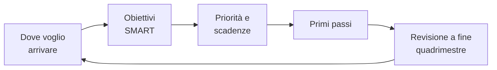
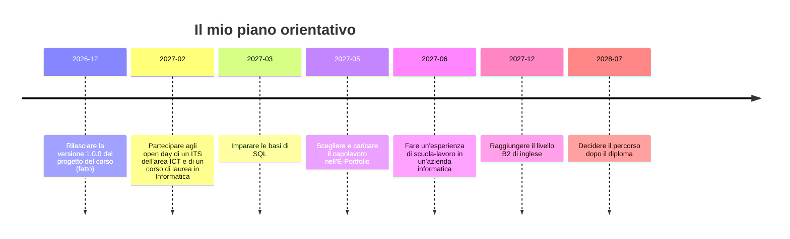

# Lezione 7.4: Il mio piano orientativo

> Contenuto originale. Riferimenti: criteri SMART, Wikipedia (in inglese), https://en.wikipedia.org/wiki/SMART_criteria ; Ministero dell'Istruzione e del Merito, circolare DGSIP n. 1616 del 17/05/2024 su E-Portfolio e capolavoro, https://mim.gov.it/documents/7501645/0/Circolare+DGSIP+prot.+n.+1616+del+17-05-2024.pdf/df2e1fea-560f-f863-6e86-fa1a209aa9e2 ; Piattaforma Unica, https://unica.istruzione.gov.it/it . I materiali del laboratorio sono nella cartella `laboratorio`.

Obiettivo: costruire un piano orientativo personale con gli stessi strumenti usati nel progetto (obiettivo, backlog, priorità, scadenze, revisioni), scrivere obiettivi SMART, preparare il colloquio con il docente tutor su E-Portfolio e capolavoro.

## 7.4.1 Il piano come un progetto

Il progetto del corso partiva da un obiettivo del cliente, lo divideva in storie con priorità e criteri di accettazione, procedeva per sprint e si correggeva nelle retrospettive. Un piano orientativo funziona allo stesso modo, con lo studente nel ruolo di cliente e di team.

| Nel progetto | Nel piano orientativo |
|---|---|
| obiettivo del prodotto | dove si vuole arrivare dopo il diploma, anche con dubbi |
| storie utente | obiettivi intermedi |
| criteri di accettazione | misura: come si capisce che l'obiettivo è raggiunto |
| priorità MoSCoW | Must, Should, Could |
| compiti dello sprint | primo passo concreto |
| board Kanban | stato: da fare, in corso, fatto |
| retrospettiva | revisione del piano a fine quadrimestre |

Diagramma: il ciclo del piano.



Un piano non è una promessa definitiva: cambia con le informazioni nuove, come il backlog è cambiato con la richiesta del cliente nello sprint 2. Cambiare un obiettivo dopo averci riflettuto è un risultato, non un fallimento.

## 7.4.2 Obiettivi SMART

I criteri SMART sono stati proposti da George T. Doran nel 1981 per gli obiettivi aziendali e oggi si usano anche per quelli personali. Un obiettivo SMART è:

- **S**pecifico: dice esattamente che cosa si vuole ottenere
- **M**isurabile: ha un indicatore che mostra se è raggiunto
- **A**ttribuibile (nella versione originale; oggi spesso "raggiungibile"): è chiaro chi lo realizza
- **R**ealistico: si può ottenere con le risorse e il tempo disponibili
- **T**emporizzato: ha una scadenza

| Obiettivo vago | Obiettivo SMART |
|---|---|
| informarmi sull'università | partecipare a 2 open day entro febbraio e annotare le informazioni nel confronto dei percorsi |
| migliorare in inglese | ottenere la certificazione B2 entro dicembre 2027, frequentando il corso pomeridiano della scuola |
| imparare a programmare meglio | svolgere 20 esercizi di SQL entro marzo |

Un obiettivo lontano (la scelta dopo il diploma) si divide in tappe intermedie con scadenze vicine: la prima tappa dovrebbe essere raggiungibile entro pochi mesi.

## 7.4.3 E-Portfolio e capolavoro

Nella Piattaforma Unica ogni studente ha un **E-Portfolio**, che raccoglie il percorso scolastico, le competenze sviluppate anche fuori dalla scuola e il **capolavoro**. Secondo la circolare del Ministero n. 1616 del 17/05/2024:

- il capolavoro è scelto dallo studente "in prima persona e in autonomia", come il prodotto più rappresentativo delle competenze sviluppate
- il **docente tutor** accompagna la scelta e la riflessione, che è parte del percorso di autovalutazione e quindi di orientamento
- si individua almeno un capolavoro entro il termine delle attività didattiche, e comunque non più di tre in un anno

Il progetto del corso, con la riflessione della lezione 6.3, è un candidato possibile; la scelta spetta allo studente.

## 7.4.4 Laboratorio

Tempo indicativo: 45 minuti. Cartella di lavoro `C:\corso-impresa\lab74`, con i file della cartella `laboratorio`.

### Parte 1: il piano (25 minuti)

1. Copiare `modello_piano.md` in `piano.md`; `piano_esempio.md` mostra il piano di uno studente di fantasia.
2. Scrivere "Dove voglio arrivare" usando la scheda delle professioni (lezione 7.1) e il confronto tra percorsi (lezione 7.2).
3. Scrivere da 4 a 7 obiettivi nella tabella, almeno uno entro 3 mesi; le scadenze nel formato AAAA-MM-GG.
4. Controllare e generare la linea del tempo:

```powershell
python piano_orientativo.py piano.md --timeline linea_del_tempo.md
```

```text
ATTENZIONE: obiettivo 2 "Migliorare in inglese": poco specifico ("migliorare"); indicare nella misura un numero o un risultato verificabile
ATTENZIONE: nessun obiettivo entro 3 mesi: serve almeno una tappa vicina

Obiettivi: 5; da sistemare: 0; attenzione: 2
Linea del tempo scritta in linea_del_tempo.md
```

- la linea del tempo è un diagramma Mermaid, visibile nell'anteprima Markdown di VS Code (`Ctrl+Shift+V`), che dalla versione 1.121 mostra i diagrammi Mermaid senza estensioni
- con il piano di esempio: `python piano_orientativo.py piano_esempio.md --oggi 2026-12-15 --timeline linea_esempio.md` (l'opzione `--oggi` fissa la data di riferimento, per ottenere sempre lo stesso risultato)

Diagramma: la linea del tempo del piano di esempio.



Come si legge la tabella del piano:

```python
for i, riga in enumerate(righe):
    intestazione = [c.lower() for c in celle(riga)]
    if intestazione == COLONNE:
        dati = righe[i + 2:]           # salta la riga |---|---|
        return [dict(zip(COLONNE, celle(r))) for r in dati]
```

- `celle` divide una riga di tabella Markdown sul carattere `|` e toglie gli spazi
- la tabella del piano si riconosce dall'intestazione, quindi il file può contenere altro testo e altre tabelle
- `zip` accoppia i nomi delle colonne con le celle di ogni riga; `dict` ne fa un dizionario, per esempio `{"obiettivo": "Imparare le basi di SQL", "priorità": "Should", ...}`

Come si calcolano i mesi tra due date, per i controlli sulle scadenze:

```python
def mesi_tra(inizio, fine):
    return (fine.year - inizio.year) * 12 + fine.month - inizio.month
```

- `date.fromisoformat` trasforma "2027-02-28" in una data, e rifiuta date inesistenti come "2027-02-30"
- la differenza in mesi ignora i giorni: per un piano personale la precisione al mese basta

Test: `python test_piano_orientativo.py` (17 test).

### Parte 2: il colloquio con il docente tutor (10 minuti di preparazione)

Ogni studente compila `colloquio_docente_tutor.md`, che porterà al colloquio con il docente tutor insieme al piano, alla riflessione della lezione 6.3, al confronto della lezione 7.2 e al CV della lezione 7.3. Tutti questi file restano allo studente.

### Parte 3: chiusura del corso (10 minuti)

Giro finale: ciascuno dice in una frase un obiettivo del proprio piano e il primo passo, con la data.

## 7.4.5 Aspetti orientativi (discussione)

- Pianificare il proprio percorso con obiettivi, priorità e revisioni è una competenza che serve in ogni lavoro, non solo nell'informatica.
- Il piano si rivede a fine quadrimestre: che cosa è stato fatto, che cosa è cambiato, che cosa si ripianifica.
- Domanda: quale strumento del progetto è stato più utile per costruire il piano personale?
