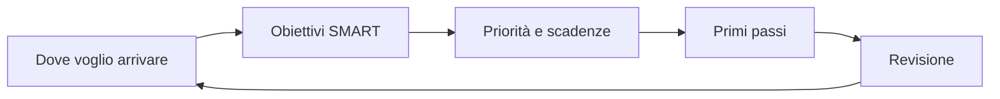

## Contenuti

- Il piano come un progetto
- Il ciclo del piano
- Obiettivi SMART
- E-Portfolio e capolavoro
- Laboratorio
- Aspetti orientativi

## Il piano come un progetto

| Progetto | Piano |
|---|---|
| storie utente | obiettivi intermedi |
| criteri di accettazione | misura |
| MoSCoW | Must, Should, Could |
| retrospettiva | revisione a fine quadrimestre |

## Il ciclo del piano

## Obiettivi SMART

- Specifico, Misurabile, Attribuibile, Realistico, Temporizzato
- "Migliorare in inglese" diventa "certificazione B2 entro dicembre 2027"
- Obiettivi lontani divisi in tappe vicine

## E-Portfolio e capolavoro

- Capolavoro scelto dallo studente
- Accompagnamento del docente tutor
- Almeno uno entro la fine delle lezioni, non più di tre all'anno

## Laboratorio

1. `piano.md` e `piano_orientativo.py`, linea del tempo
2. Traccia per il colloquio con il docente tutor
3. Giro finale: un obiettivo e il primo passo

## Aspetti orientativi

- Pianificare è una competenza per ogni lavoro
- Il piano si rivede a fine quadrimestre
- Quale strumento del progetto è stato più utile?
